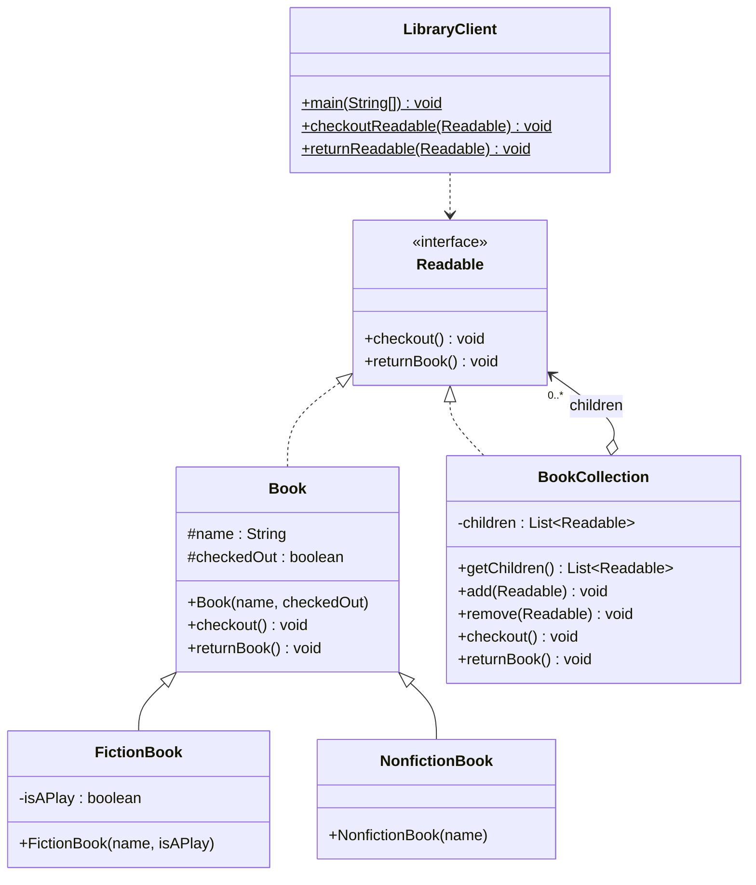

# lab01_UML / task_3_3 — UML діаграма класів проекту

Завдання: **зобразити UML-діаграму класів проекту**. Проект реалізує патерн
**Composite (Компонувальник)**: клієнт працює з окремою книгою та з колекцією
книг через один інтерфейс `Readable`.

| Роль у патерні | Клас |
|---|---|
| Component | `Readable` (interface) |
| Leaf | `Book`, `FictionBook`, `NonfictionBook` |
| Composite | `BookCollection` |
| Client | `LibraryClient` |

`BookCollection` теж реалізує `Readable` і зберігає список `children`,
делегуючи `checkout()` / `returnBook()` усім дочірнім елементам.

## Діаграма класів



Та сама діаграма як зображення: [`img/diagram.svg`](img/diagram.svg).

## Запуск

```bash
javac *.java && java LibraryClient
```
