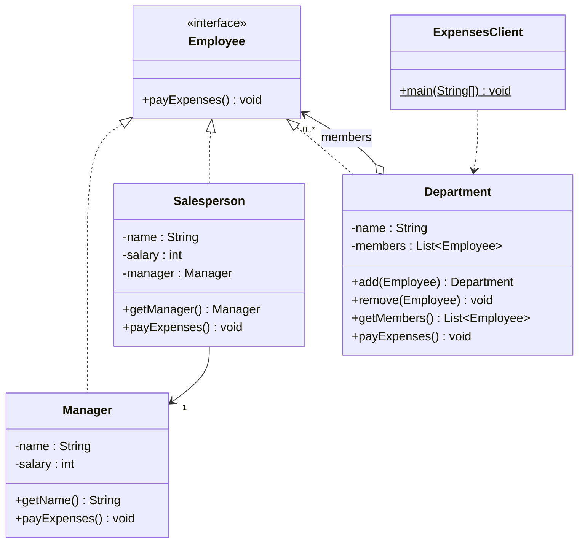

# lab09_Composite / task_3_1 — нарахування зарплати (Composite)

Розглядається модель магазину з двома типами співробітників — **менеджери** та
**продавці**; усі отримують зарплату відповідно до посади.

Завдання: провести **рефакторинг із застосуванням патерну Компонувальник
(Composite)** так, щоб програма нараховувала зарплату працівникам супермаркету.
Супермаркет очолюється директором (менеджером), містить **три відділи**
(м'ясний, молочний, кондитерський), кожен з яких очолюється менеджером і містить
**принаймні трьох продавців**.

## Ідея рішення

Вводиться спільний інтерфейс **`Employee`** (Component) з методом
`payExpenses()`. Окремі працівники — **`Manager`** і **`Salesperson`** (Leaf) —
та контейнер **`Department`** (Composite) реалізують цей самий інтерфейс. Відділ
зберігає список `Employee` і в `payExpenses()` делегує нарахування всім дочірнім
елементам. Оскільки `Department` теж є `Employee`, відділи можна вкладати один в
одного (супермаркет = відділ, що містить директора і три відділи). Завдяки цьому
клієнт нараховує зарплату **всій структурі одним викликом** і не розрізняє
окремого працівника та цілий відділ.

| Роль у патерні | Клас |
|---|---|
| Component | `Employee` (interface) |
| Leaf | `Manager`, `Salesperson` |
| Composite | `Department` |
| Client | `ExpensesClient` |

## Діаграма класів (після рефакторингу)



## Запуск

```bash
javac *.java
java ExpensesClient
```
