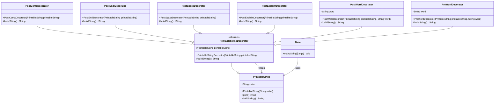

```mermaid
classDiagram
    class PrintableString {
        -String value
        +PrintableString(String value)
        +print() void
        #buildString() String
    }

    class PrintableStringDecorator {
        <<abstract>>
        #PrintableString printableString
        +PrintableStringDecorator(PrintableString printableString)
        #buildString() String
    }

    class PostComaDecorator {
        +PostComaDecorator(PrintableString printableString)
        #buildString() String
    }

    class PostEndlDecorator {
        +PostEndlDecorator(PrintableString printableString)
        #buildString() String
    }

    class PostSpaceDecorator {
        +PostSpaceDecorator(PrintableString printableString)
        #buildString() String
    }

    class PostExclaimDecorator {
        +PostExclaimDecorator(PrintableString printableString)
        #buildString() String
    }

    class PostWordDecorator {
        -String word
        +PostWordDecorator(PrintableString printableString, String word)
        #buildString() String
    }

    class PreWordDecorator {
        -String word
        +PreWordDecorator(PrintableString printableString, String word)
        #buildString() String
    }

    class Main {
        +main(String[] args) void
    }

    PrintableStringDecorator --|> PrintableString
    PostComaDecorator --|> PrintableStringDecorator
    PostEndlDecorator --|> PrintableStringDecorator
    PostSpaceDecorator --|> PrintableStringDecorator
    PostExclaimDecorator --|> PrintableStringDecorator
    PostWordDecorator --|> PrintableStringDecorator
    PreWordDecorator --|> PrintableStringDecorator
    PrintableStringDecorator --> PrintableString : wraps
    Main --> PrintableString : uses
```
