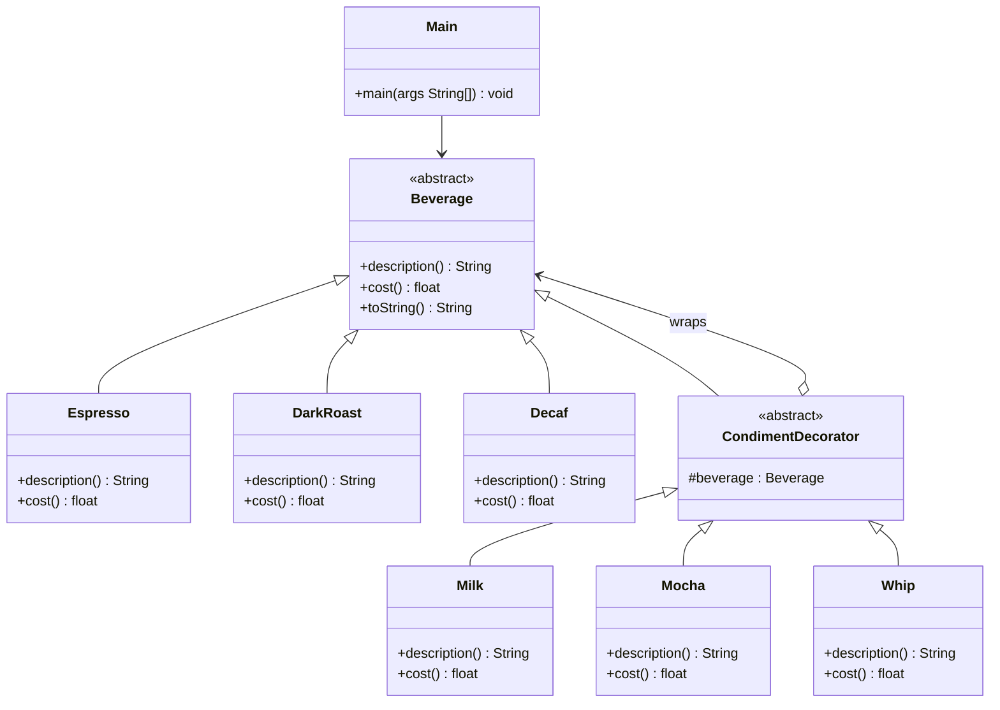

```mermaid
classDiagram
    class Beverage {
        <<abstract>>
        +description() String
        +cost() float
        +toString() String
    }

    class Espresso {
        +description() String
        +cost() float
    }

    class DarkRoast {
        +description() String
        +cost() float
    }

    class Decaf {
        +description() String
        +cost() float
    }

    class CondimentDecorator {
        <<abstract>>
        #beverage : Beverage
    }

    class Milk {
        +description() String
        +cost() float
    }

    class Mocha {
        +description() String
        +cost() float
    }

    class Whip {
        +description() String
        +cost() float
    }

    class Main {
        +main(args String[]) void
    }

    Beverage <|-- Espresso
    Beverage <|-- DarkRoast
    Beverage <|-- Decaf
    Beverage <|-- CondimentDecorator
    CondimentDecorator <|-- Milk
    CondimentDecorator <|-- Mocha
    CondimentDecorator <|-- Whip
    CondimentDecorator o--> Beverage : wraps
    Main --> Beverage
```
