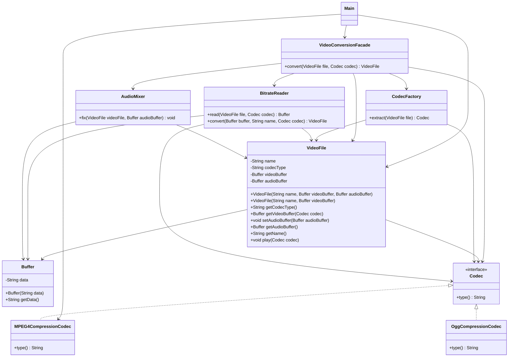

```mermaid
classDiagram
    class Main

    class VideoConversionFacade {
        +convert(VideoFile file, Codec codec) VideoFile
    }

    class VideoFile {
        -String name
        -String codecType
        -Buffer videoBuffer
        -Buffer audioBuffer
        +VideoFile(String name, Buffer videoBuffer, Buffer audioBuffer)
        +VideoFile(String name, Buffer videoBuffer)
        +String getCodecType()
        +Buffer getVideoBuffer(Codec codec)
        +void setAudioBuffer(Buffer audioBuffer)
        +Buffer getAudioBuffer()
        +String getName()
        +void play(Codec codec)
    }

    class Buffer {
        -String data
        +Buffer(String data)
        +String getData()
    }

    class Codec {
        <<interface>>
        +type() String
    }

    class MPEG4CompressionCodec {
        +type() String
    }

    class OggCompressionCodec {
        +type() String
    }

    class CodecFactory {
        +extract(VideoFile file) Codec
    }

    class BitrateReader {
        +read(VideoFile file, Codec codec) Buffer
        +convert(Buffer buffer, String name, Codec codec) VideoFile
    }

    class AudioMixer {
        +fix(VideoFile videoFile, Buffer audioBuffer) void
    }

    Main --> VideoConversionFacade
    Main --> VideoFile
    Main --> MPEG4CompressionCodec

    VideoConversionFacade --> CodecFactory
    VideoConversionFacade --> BitrateReader
    VideoConversionFacade --> AudioMixer
    VideoConversionFacade --> VideoFile
    VideoConversionFacade --> Codec

    VideoFile --> Buffer
    VideoFile --> Codec
    Codec <|.. MPEG4CompressionCodec
    Codec <|.. OggCompressionCodec
    CodecFactory --> Codec
    CodecFactory --> VideoFile
    BitrateReader --> Buffer
    BitrateReader --> VideoFile
    BitrateReader --> Codec
    AudioMixer --> VideoFile
    AudioMixer --> Buffer
```
