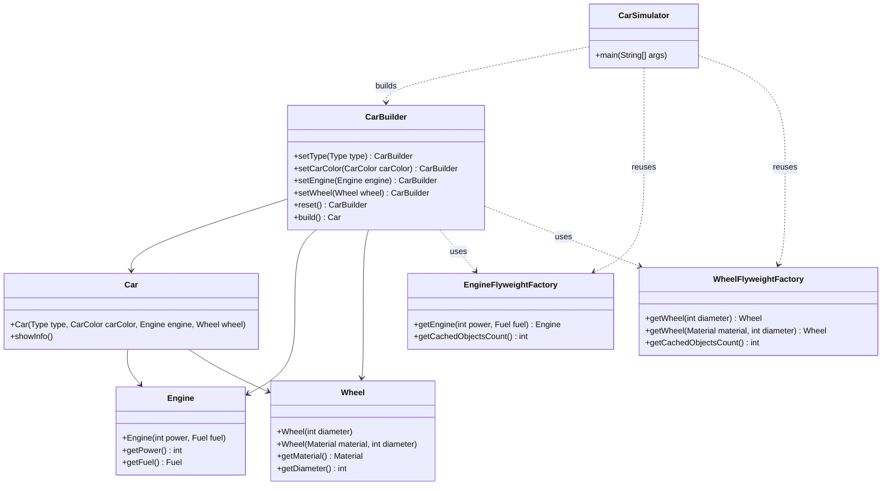

```mermaid
classDiagram
    class Car {
        +Car(Type type, CarColor carColor, Engine engine, Wheel wheel)
        +showInfo()
    }

    class CarBuilder {
        +setType(Type type) CarBuilder
        +setCarColor(CarColor carColor) CarBuilder
        +setEngine(Engine engine) CarBuilder
        +setWheel(Wheel wheel) CarBuilder
        +reset() CarBuilder
        +build() Car
    }

    class CarSimulator {
        +main(String[] args)
    }

    class Engine {
        +Engine(int power, Fuel fuel)
        +getPower() int
        +getFuel() Fuel
    }

    class Wheel {
        +Wheel(int diameter)
        +Wheel(Material material, int diameter)
        +getMaterial() Material
        +getDiameter() int
    }

    class EngineFlyweightFactory {
        +getEngine(int power, Fuel fuel) Engine
        +getCachedObjectsCount() int
    }

    class WheelFlyweightFactory {
        +getWheel(int diameter) Wheel
        +getWheel(Material material, int diameter) Wheel
        +getCachedObjectsCount() int
    }

    Car --> Engine
    Car --> Wheel
    CarBuilder --> Car
    CarBuilder --> Engine
    CarBuilder --> Wheel
    CarBuilder ..> EngineFlyweightFactory : uses
    CarBuilder ..> WheelFlyweightFactory : uses
    CarSimulator ..> CarBuilder : builds
    CarSimulator ..> EngineFlyweightFactory : reuses
    CarSimulator ..> WheelFlyweightFactory : reuses
```
