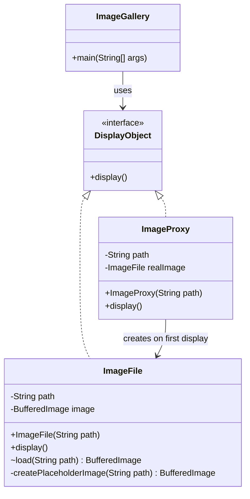

```mermaid
classDiagram
    class DisplayObject {
        <<interface>>
        +display()
    }

    class ImageFile {
        -String path
        -BufferedImage image
        +ImageFile(String path)
        +display()
        ~load(String path) BufferedImage
        -createPlaceholderImage(String path) BufferedImage
    }

    class ImageProxy {
        -String path
        -ImageFile realImage
        +ImageProxy(String path)
        +display()
    }

    class ImageGallery {
        +main(String[] args)
    }

    DisplayObject <|.. ImageFile
    DisplayObject <|.. ImageProxy
    ImageProxy --> ImageFile : creates on first display
    ImageGallery --> DisplayObject : uses
```
