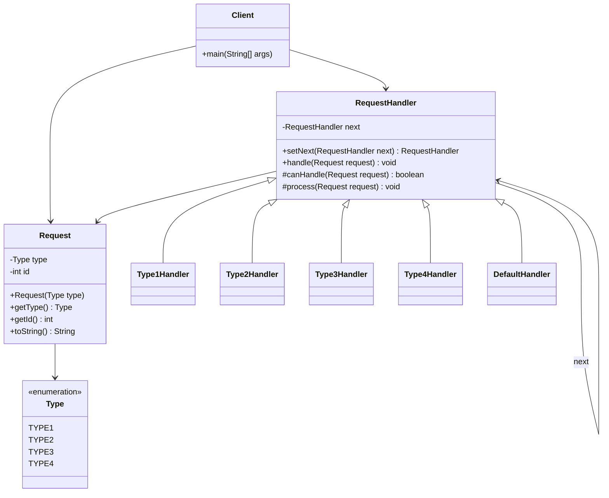

```mermaid
classDiagram
    class Client {
        +main(String[] args)
    }

    class Request {
        -Type type
        -int id
        +Request(Type type)
        +getType() Type
        +getId() int
        +toString() String
    }

    class Type {
        <<enumeration>>
        TYPE1
        TYPE2
        TYPE3
        TYPE4
    }

    class RequestHandler {
        -RequestHandler next
        +setNext(RequestHandler next) RequestHandler
        +handle(Request request) void
        #canHandle(Request request) boolean
        #process(Request request) void
    }

    class Type1Handler
    class Type2Handler
    class Type3Handler
    class Type4Handler
    class DefaultHandler

    Client --> Request
    Client --> RequestHandler
    Request --> Type
    RequestHandler <|-- Type1Handler
    RequestHandler <|-- Type2Handler
    RequestHandler <|-- Type3Handler
    RequestHandler <|-- Type4Handler
    RequestHandler <|-- DefaultHandler
    RequestHandler --> RequestHandler : next
    RequestHandler --> Request
```
