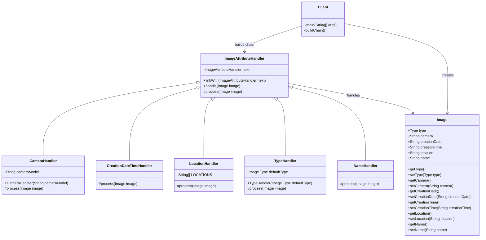

```mermaid
classDiagram
    class Image {
        +Type type
        +String camera
        +String creationDate
        +String creationTime
        +String location
        +String name
        +getType()
        +setType(Type type)
        +getCamera()
        +setCamera(String camera)
        +getCreationDate()
        +setCreationDate(String creationDate)
        +getCreationTime()
        +setCreationTime(String creationTime)
        +getLocation()
        +setLocation(String location)
        +getName()
        +setName(String name)
    }

    class ImageAttributeHandler {
        -ImageAttributeHandler next
        +linkWith(ImageAttributeHandler next)
        +handle(Image image)
        #process(Image image)
    }

    class CameraHandler {
        -String cameraModel
        +CameraHandler(String cameraModel)
        #process(Image image)
    }

    class CreationDateTimeHandler {
        #process(Image image)
    }

    class LocationHandler {
        -String[] LOCATIONS
        #process(Image image)
    }

    class TypeHandler {
        -Image.Type defaultType
        +TypeHandler(Image.Type defaultType)
        #process(Image image)
    }

    class NameHandler {
        #process(Image image)
    }

    class Client {
        +main(String[] args)
        -buildChain()
    }

    ImageAttributeHandler <|-- CameraHandler
    ImageAttributeHandler <|-- CreationDateTimeHandler
    ImageAttributeHandler <|-- LocationHandler
    ImageAttributeHandler <|-- TypeHandler
    ImageAttributeHandler <|-- NameHandler
    ImageAttributeHandler --> Image : handles
    Client --> ImageAttributeHandler : builds chain
    Client --> Image : creates
```
