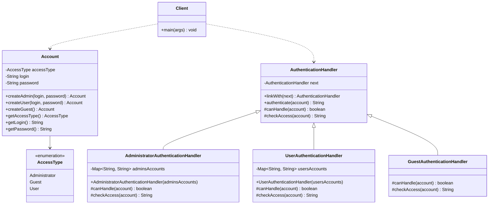

```mermaid
classDiagram
    class Account {
        -AccessType accessType
        -String login
        -String password
        +createAdmin(login, password) Account
        +createUser(login, password) Account
        +createGuest() Account
        +getAccessType() AccessType
        +getLogin() String
        +getPassword() String
    }

    class AccessType {
        <<enumeration>>
        Administrator
        Guest
        User
    }

    class AuthenticationHandler {
        -AuthenticationHandler next
        +linkWith(next) AuthenticationHandler
        +authenticate(account) String
        #canHandle(account) boolean
        #checkAccess(account) String
    }

    class AdministratorAuthenticationHandler {
        -Map~String, String~ adminsAccounts
        +AdministratorAuthenticationHandler(adminsAccounts)
        #canHandle(account) boolean
        #checkAccess(account) String
    }

    class UserAuthenticationHandler {
        -Map~String, String~ usersAccounts
        +UserAuthenticationHandler(usersAccounts)
        #canHandle(account) boolean
        #checkAccess(account) String
    }

    class GuestAuthenticationHandler {
        #canHandle(account) boolean
        #checkAccess(account) String
    }

    class Client {
        +main(args) void
    }

    Account --> AccessType
    AuthenticationHandler <|-- AdministratorAuthenticationHandler
    AuthenticationHandler <|-- UserAuthenticationHandler
    AuthenticationHandler <|-- GuestAuthenticationHandler
    Client ..> Account
    Client ..> AuthenticationHandler
```
