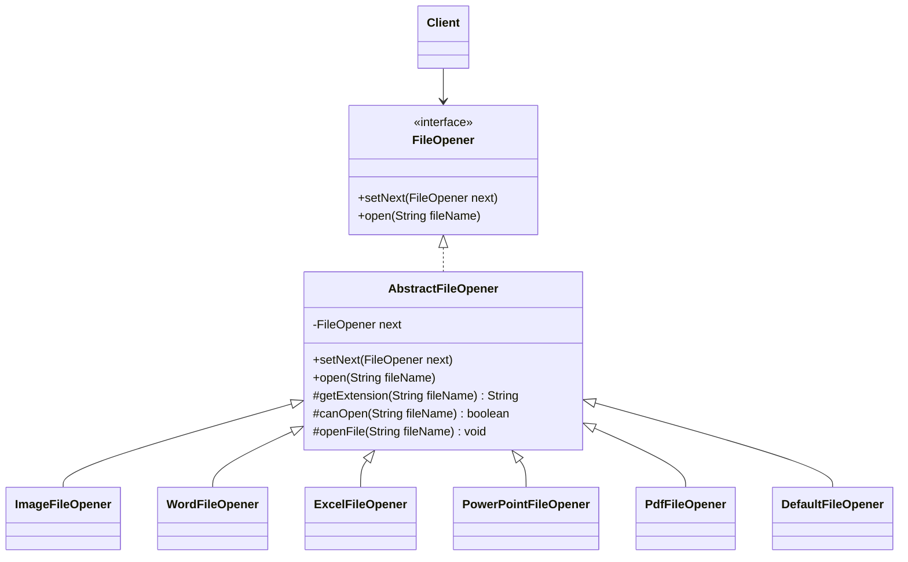

```mermaid
classDiagram
    class Client

    class FileOpener {
        <<interface>>
        +setNext(FileOpener next)
        +open(String fileName)
    }

    class AbstractFileOpener {
        -FileOpener next
        +setNext(FileOpener next)
        +open(String fileName)
        #getExtension(String fileName) String
        #canOpen(String fileName) boolean
        #openFile(String fileName) void
    }

    class ImageFileOpener
    class WordFileOpener
    class ExcelFileOpener
    class PowerPointFileOpener
    class PdfFileOpener
    class DefaultFileOpener

    FileOpener <|.. AbstractFileOpener
    AbstractFileOpener <|-- ImageFileOpener
    AbstractFileOpener <|-- WordFileOpener
    AbstractFileOpener <|-- ExcelFileOpener
    AbstractFileOpener <|-- PowerPointFileOpener
    AbstractFileOpener <|-- PdfFileOpener
    AbstractFileOpener <|-- DefaultFileOpener
    Client --> FileOpener
```
