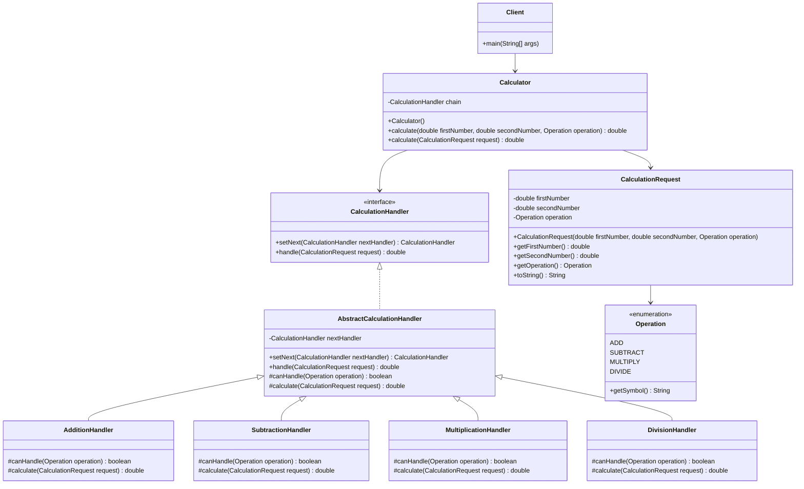

```mermaid
classDiagram
    class Client {
        +main(String[] args)
    }

    class Calculator {
        -CalculationHandler chain
        +Calculator()
        +calculate(double firstNumber, double secondNumber, Operation operation) double
        +calculate(CalculationRequest request) double
    }

    class CalculationRequest {
        -double firstNumber
        -double secondNumber
        -Operation operation
        +CalculationRequest(double firstNumber, double secondNumber, Operation operation)
        +getFirstNumber() double
        +getSecondNumber() double
        +getOperation() Operation
        +toString() String
    }

    class CalculationHandler {
        <<interface>>
        +setNext(CalculationHandler nextHandler) CalculationHandler
        +handle(CalculationRequest request) double
    }

    class AbstractCalculationHandler {
        -CalculationHandler nextHandler
        +setNext(CalculationHandler nextHandler) CalculationHandler
        +handle(CalculationRequest request) double
        #canHandle(Operation operation) boolean
        #calculate(CalculationRequest request) double
    }

    class AdditionHandler {
        #canHandle(Operation operation) boolean
        #calculate(CalculationRequest request) double
    }

    class SubtractionHandler {
        #canHandle(Operation operation) boolean
        #calculate(CalculationRequest request) double
    }

    class MultiplicationHandler {
        #canHandle(Operation operation) boolean
        #calculate(CalculationRequest request) double
    }

    class DivisionHandler {
        #canHandle(Operation operation) boolean
        #calculate(CalculationRequest request) double
    }

    class Operation {
        <<enumeration>>
        ADD
        SUBTRACT
        MULTIPLY
        DIVIDE
        +getSymbol() String
    }

    Client --> Calculator
    Calculator --> CalculationHandler
    Calculator --> CalculationRequest
    CalculationHandler <|.. AbstractCalculationHandler
    AbstractCalculationHandler <|-- AdditionHandler
    AbstractCalculationHandler <|-- SubtractionHandler
    AbstractCalculationHandler <|-- MultiplicationHandler
    AbstractCalculationHandler <|-- DivisionHandler
    CalculationRequest --> Operation
```
