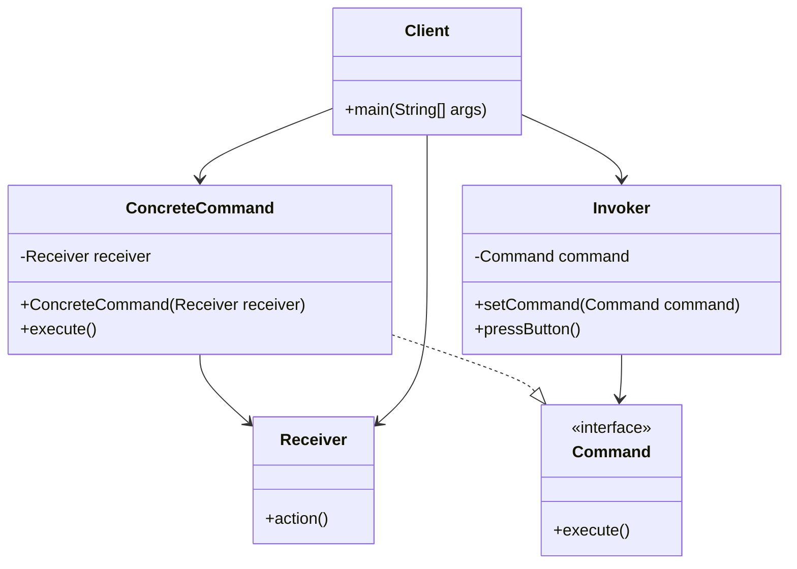

```mermaid
classDiagram
    class Client {
        +main(String[] args)
    }

    class Command {
        <<interface>>
        +execute()
    }

    class ConcreteCommand {
        -Receiver receiver
        +ConcreteCommand(Receiver receiver)
        +execute()
    }

    class Receiver {
        +action()
    }

    class Invoker {
        -Command command
        +setCommand(Command command)
        +pressButton()
    }

    ConcreteCommand ..|> Command
    ConcreteCommand --> Receiver
    Invoker --> Command
    Client --> Receiver
    Client --> ConcreteCommand
    Client --> Invoker
```
