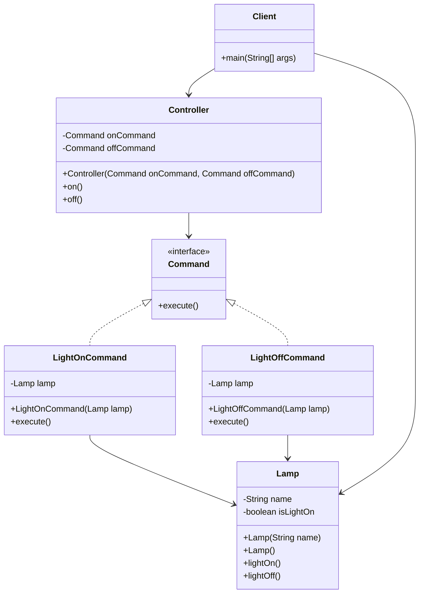

```mermaid
classDiagram
    class Command {
        <<interface>>
        +execute()
    }

    class Lamp {
        -String name
        -boolean isLightOn
        +Lamp(String name)
        +Lamp()
        +lightOn()
        +lightOff()
    }

    class LightOnCommand {
        -Lamp lamp
        +LightOnCommand(Lamp lamp)
        +execute()
    }

    class LightOffCommand {
        -Lamp lamp
        +LightOffCommand(Lamp lamp)
        +execute()
    }

    class Controller {
        -Command onCommand
        -Command offCommand
        +Controller(Command onCommand, Command offCommand)
        +on()
        +off()
    }

    class Client {
        +main(String[] args)
    }

    Command <|.. LightOnCommand
    Command <|.. LightOffCommand
    LightOnCommand --> Lamp
    LightOffCommand --> Lamp
    Controller --> Command
    Client --> Controller
    Client --> Lamp
```
