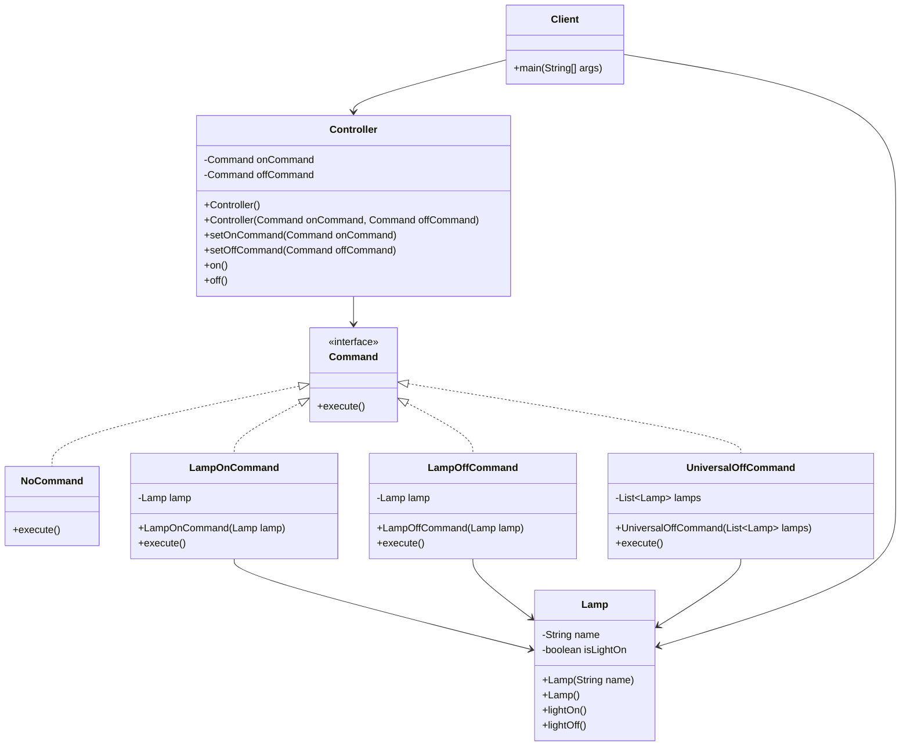

```mermaid
classDiagram
    class Command {
        <<interface>>
        +execute()
    }

    class NoCommand {
        +execute()
    }

    class Lamp {
        -String name
        -boolean isLightOn
        +Lamp(String name)
        +Lamp()
        +lightOn()
        +lightOff()
    }

    class LampOnCommand {
        -Lamp lamp
        +LampOnCommand(Lamp lamp)
        +execute()
    }

    class LampOffCommand {
        -Lamp lamp
        +LampOffCommand(Lamp lamp)
        +execute()
    }

    class UniversalOffCommand {
        -List~Lamp~ lamps
        +UniversalOffCommand(List~Lamp~ lamps)
        +execute()
    }

    class Controller {
        -Command onCommand
        -Command offCommand
        +Controller()
        +Controller(Command onCommand, Command offCommand)
        +setOnCommand(Command onCommand)
        +setOffCommand(Command offCommand)
        +on()
        +off()
    }

    class Client {
        +main(String[] args)
    }

    Command <|.. NoCommand
    Command <|.. LampOnCommand
    Command <|.. LampOffCommand
    Command <|.. UniversalOffCommand

    LampOnCommand --> Lamp
    LampOffCommand --> Lamp
    UniversalOffCommand --> Lamp
    Controller --> Command
    Client --> Controller
    Client --> Lamp
```
