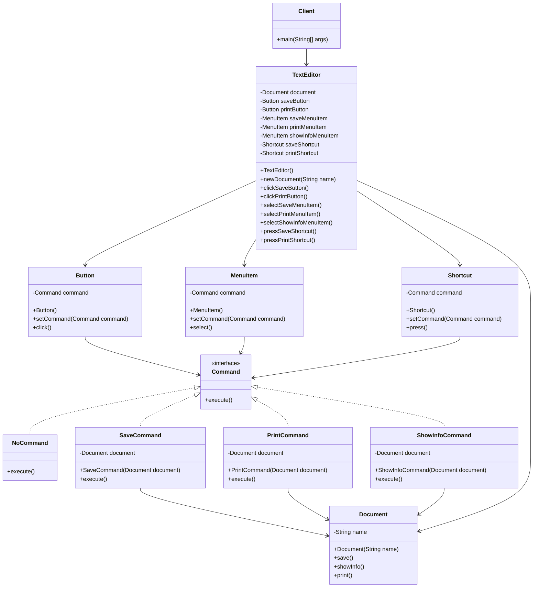

```mermaid
classDiagram
    class Command {
        <<interface>>
        +execute()
    }

    class NoCommand {
        +execute()
    }

    class Document {
        -String name
        +Document(String name)
        +save()
        +showInfo()
        +print()
    }

    class Button {
        -Command command
        +Button()
        +setCommand(Command command)
        +click()
    }

    class MenuItem {
        -Command command
        +MenuItem()
        +setCommand(Command command)
        +select()
    }

    class Shortcut {
        -Command command
        +Shortcut()
        +setCommand(Command command)
        +press()
    }

    class SaveCommand {
        -Document document
        +SaveCommand(Document document)
        +execute()
    }

    class PrintCommand {
        -Document document
        +PrintCommand(Document document)
        +execute()
    }

    class ShowInfoCommand {
        -Document document
        +ShowInfoCommand(Document document)
        +execute()
    }

    class TextEditor {
        -Document document
        -Button saveButton
        -Button printButton
        -MenuItem saveMenuItem
        -MenuItem printMenuItem
        -MenuItem showInfoMenuItem
        -Shortcut saveShortcut
        -Shortcut printShortcut
        +TextEditor()
        +newDocument(String name)
        +clickSaveButton()
        +clickPrintButton()
        +selectSaveMenuItem()
        +selectPrintMenuItem()
        +selectShowInfoMenuItem()
        +pressSaveShortcut()
        +pressPrintShortcut()
    }

    class Client {
        +main(String[] args)
    }

    Command <|.. NoCommand
    Command <|.. SaveCommand
    Command <|.. PrintCommand
    Command <|.. ShowInfoCommand

    SaveCommand --> Document
    PrintCommand --> Document
    ShowInfoCommand --> Document

    Button --> Command
    MenuItem --> Command
    Shortcut --> Command

    TextEditor --> Document
    TextEditor --> Button
    TextEditor --> MenuItem
    TextEditor --> Shortcut
    Client --> TextEditor
```
