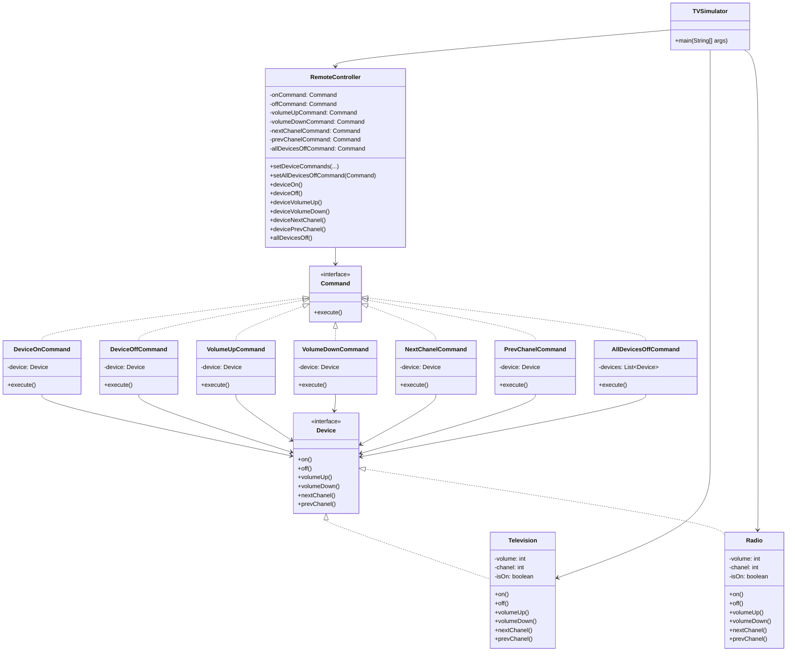

```mermaid
classDiagram
    class Device {
        <<interface>>
        +on()
        +off()
        +volumeUp()
        +volumeDown()
        +nextChanel()
        +prevChanel()
    }

    class Command {
        <<interface>>
        +execute()
    }

    class RemoteController {
        -onCommand: Command
        -offCommand: Command
        -volumeUpCommand: Command
        -volumeDownCommand: Command
        -nextChanelCommand: Command
        -prevChanelCommand: Command
        -allDevicesOffCommand: Command
        +setDeviceCommands(...)
        +setAllDevicesOffCommand(Command)
        +deviceOn()
        +deviceOff()
        +deviceVolumeUp()
        +deviceVolumeDown()
        +deviceNextChanel()
        +devicePrevChanel()
        +allDevicesOff()
    }

    class Television {
        -volume: int
        -chanel: int
        -isOn: boolean
        +on()
        +off()
        +volumeUp()
        +volumeDown()
        +nextChanel()
        +prevChanel()
    }

    class Radio {
        -volume: int
        -chanel: int
        -isOn: boolean
        +on()
        +off()
        +volumeUp()
        +volumeDown()
        +nextChanel()
        +prevChanel()
    }

    class DeviceOnCommand {
        -device: Device
        +execute()
    }

    class DeviceOffCommand {
        -device: Device
        +execute()
    }

    class VolumeUpCommand {
        -device: Device
        +execute()
    }

    class VolumeDownCommand {
        -device: Device
        +execute()
    }

    class NextChanelCommand {
        -device: Device
        +execute()
    }

    class PrevChanelCommand {
        -device: Device
        +execute()
    }

    class AllDevicesOffCommand {
        -devices: List~Device~
        +execute()
    }

    class TVSimulator {
        +main(String[] args)
    }

    Device <|.. Television
    Device <|.. Radio

    Command <|.. DeviceOnCommand
    Command <|.. DeviceOffCommand
    Command <|.. VolumeUpCommand
    Command <|.. VolumeDownCommand
    Command <|.. NextChanelCommand
    Command <|.. PrevChanelCommand
    Command <|.. AllDevicesOffCommand

    DeviceOnCommand --> Device
    DeviceOffCommand --> Device
    VolumeUpCommand --> Device
    VolumeDownCommand --> Device
    NextChanelCommand --> Device
    PrevChanelCommand --> Device
    AllDevicesOffCommand --> Device

    RemoteController --> Command
    TVSimulator --> RemoteController
    TVSimulator --> Television
    TVSimulator --> Radio
```
