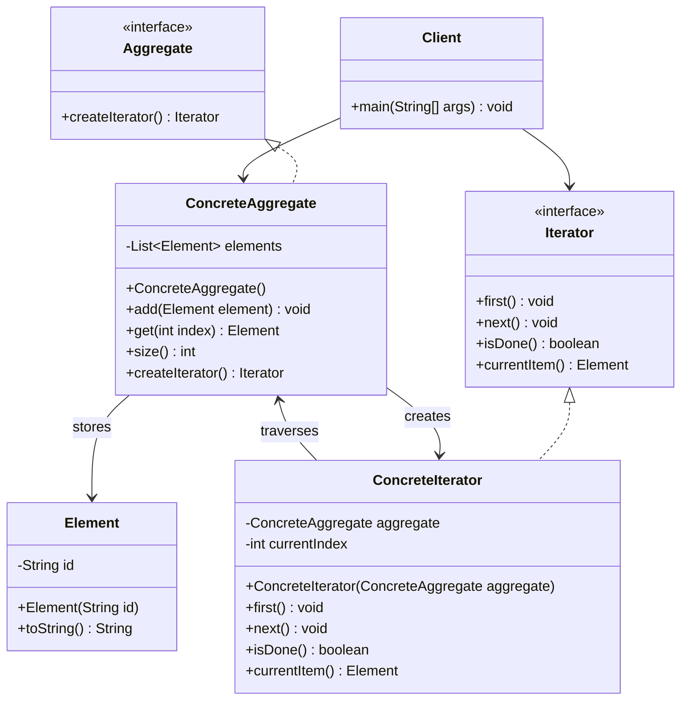

```mermaid
classDiagram
    class Client {
        +main(String[] args) void
    }

    class Element {
        -String id
        +Element(String id)
        +toString() String
    }

    class Iterator {
        <<interface>>
        +first() void
        +next() void
        +isDone() boolean
        +currentItem() Element
    }

    class Aggregate {
        <<interface>>
        +createIterator() Iterator
    }

    class ConcreteAggregate {
        -List~Element~ elements
        +ConcreteAggregate()
        +add(Element element) void
        +get(int index) Element
        +size() int
        +createIterator() Iterator
    }

    class ConcreteIterator {
        -ConcreteAggregate aggregate
        -int currentIndex
        +ConcreteIterator(ConcreteAggregate aggregate)
        +first() void
        +next() void
        +isDone() boolean
        +currentItem() Element
    }

    Aggregate <|.. ConcreteAggregate
    Iterator <|.. ConcreteIterator
    ConcreteAggregate --> Element : stores
    ConcreteAggregate --> ConcreteIterator : creates
    ConcreteIterator --> ConcreteAggregate : traverses
    Client --> ConcreteAggregate
    Client --> Iterator
```
