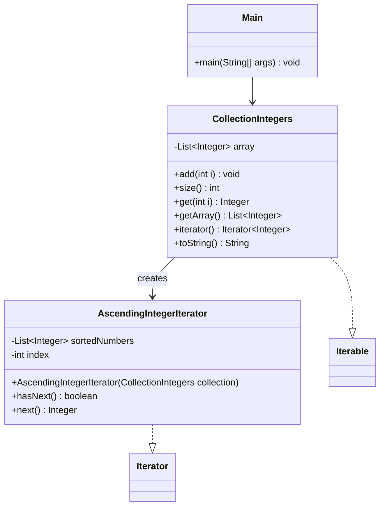

```mermaid
classDiagram
    class CollectionIntegers {
        -List~Integer~ array
        +add(int i) void
        +size() int
        +get(int i) Integer
        +getArray() List~Integer~
        +iterator() Iterator~Integer~
        +toString() String
    }

    class AscendingIntegerIterator {
        -List~Integer~ sortedNumbers
        -int index
        +AscendingIntegerIterator(CollectionIntegers collection)
        +hasNext() boolean
        +next() Integer
    }

    class Main {
        +main(String[] args) void
    }

    CollectionIntegers ..|> Iterable
    AscendingIntegerIterator ..|> Iterator
    CollectionIntegers --> AscendingIntegerIterator : creates
    Main --> CollectionIntegers
```

