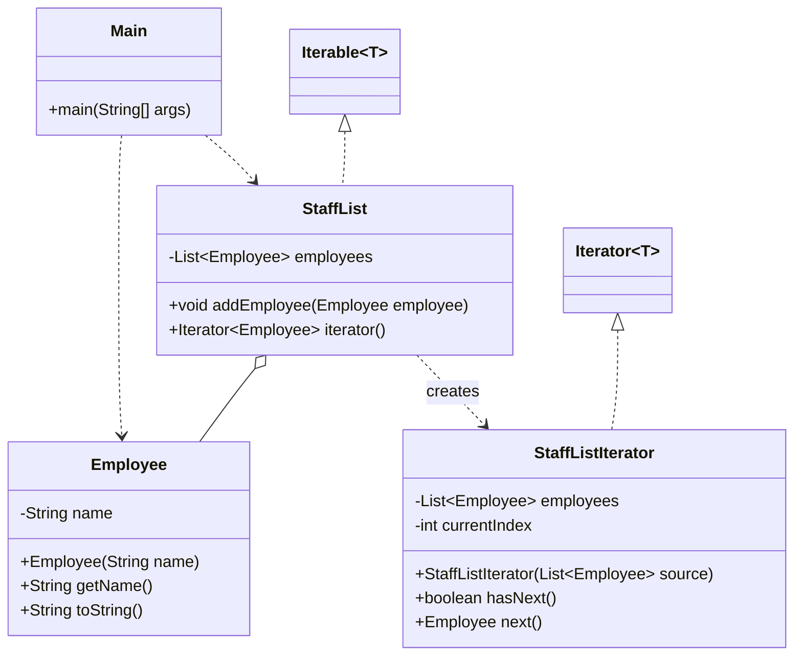

```mermaid
classDiagram
    class Employee {
        -String name
        +Employee(String name)
        +String getName()
        +String toString()
    }

    class StaffList {
        -List~Employee~ employees
        +void addEmployee(Employee employee)
        +Iterator~Employee~ iterator()
    }

    class StaffListIterator {
        -List~Employee~ employees
        -int currentIndex
        +StaffListIterator(List~Employee~ source)
        +boolean hasNext()
        +Employee next()
    }

    class Main {
        +main(String[] args)
    }

    Iterable~T~ <|.. StaffList
    Iterator~T~ <|.. StaffListIterator
    StaffList o-- Employee
    StaffList ..> StaffListIterator : creates
    Main ..> StaffList
    Main ..> Employee
```
