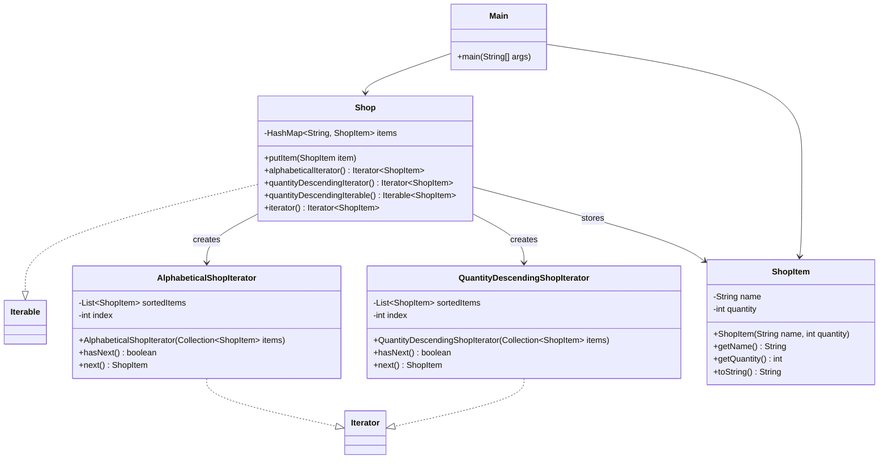

```mermaid
classDiagram
    class Main {
        +main(String[] args)
    }

    class Shop {
        -HashMap~String, ShopItem~ items
        +putItem(ShopItem item)
        +alphabeticalIterator() Iterator~ShopItem~
        +quantityDescendingIterator() Iterator~ShopItem~
        +quantityDescendingIterable() Iterable~ShopItem~
        +iterator() Iterator~ShopItem~
    }

    class ShopItem {
        -String name
        -int quantity
        +ShopItem(String name, int quantity)
        +getName() String
        +getQuantity() int
        +toString() String
    }

    class AlphabeticalShopIterator {
        -List~ShopItem~ sortedItems
        -int index
        +AlphabeticalShopIterator(Collection~ShopItem~ items)
        +hasNext() boolean
        +next() ShopItem
    }

    class QuantityDescendingShopIterator {
        -List~ShopItem~ sortedItems
        -int index
        +QuantityDescendingShopIterator(Collection~ShopItem~ items)
        +hasNext() boolean
        +next() ShopItem
    }

    Shop ..|> Iterable
    AlphabeticalShopIterator ..|> Iterator
    QuantityDescendingShopIterator ..|> Iterator
    Shop --> AlphabeticalShopIterator : creates
    Shop --> QuantityDescendingShopIterator : creates
    Shop --> ShopItem : stores
    Main --> Shop
    Main --> ShopItem
```

