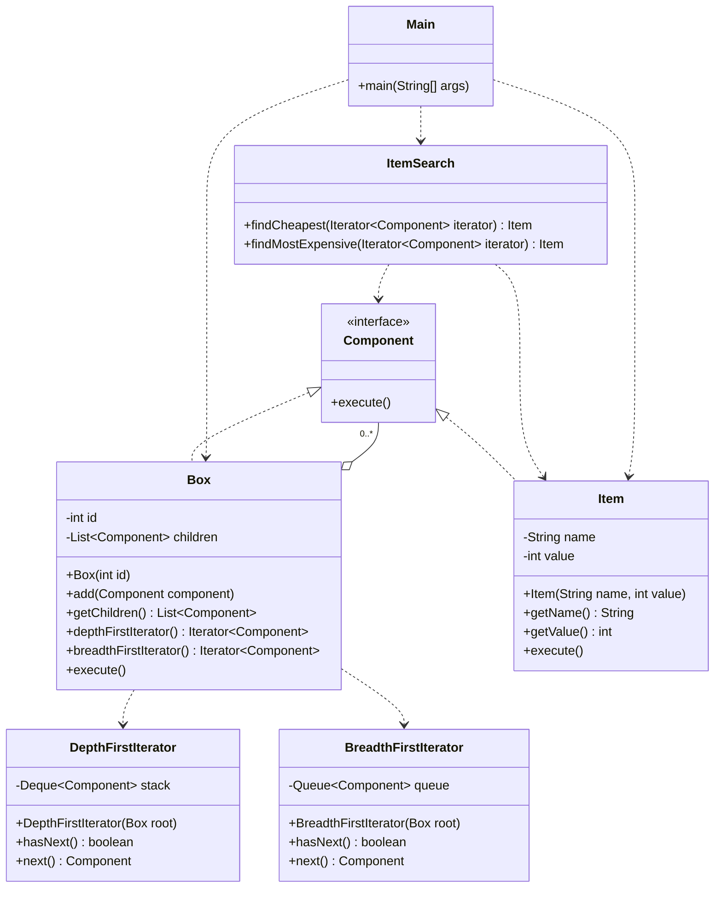

```mermaid
classDiagram
    class Component {
        <<interface>>
        +execute()
    }

    class Box {
        -int id
        -List~Component~ children
        +Box(int id)
        +add(Component component)
        +getChildren() List~Component~
        +depthFirstIterator() Iterator~Component~
        +breadthFirstIterator() Iterator~Component~
        +execute()
    }

    class Item {
        -String name
        -int value
        +Item(String name, int value)
        +getName() String
        +getValue() int
        +execute()
    }

    class DepthFirstIterator {
        -Deque~Component~ stack
        +DepthFirstIterator(Box root)
        +hasNext() boolean
        +next() Component
    }

    class BreadthFirstIterator {
        -Queue~Component~ queue
        +BreadthFirstIterator(Box root)
        +hasNext() boolean
        +next() Component
    }

    class ItemSearch {
        +findCheapest(Iterator~Component~ iterator) Item
        +findMostExpensive(Iterator~Component~ iterator) Item
    }

    class Main {
        +main(String[] args)
    }

    Component <|.. Box
    Component <|.. Item
    Box o-- "0..*" Component
    Box ..> DepthFirstIterator
    Box ..> BreadthFirstIterator
    ItemSearch ..> Component
    ItemSearch ..> Item
    Main ..> Box
    Main ..> Item
    Main ..> ItemSearch
```
