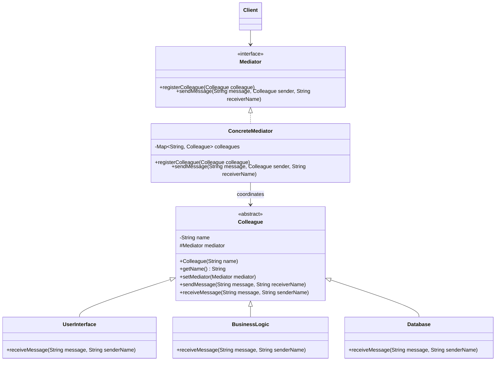

```mermaid
classDiagram
    class Client

    class Mediator {
        <<interface>>
        +registerColleague(Colleague colleague)
        +sendMessage(String message, Colleague sender, String receiverName)
    }

    class ConcreteMediator {
        -Map~String, Colleague~ colleagues
        +registerColleague(Colleague colleague)
        +sendMessage(String message, Colleague sender, String receiverName)
    }

    class Colleague {
        <<abstract>>
        -String name
        #Mediator mediator
        +Colleague(String name)
        +getName() String
        +setMediator(Mediator mediator)
        +sendMessage(String message, String receiverName)
        +receiveMessage(String message, String senderName)
    }

    class UserInterface {
        +receiveMessage(String message, String senderName)
    }

    class BusinessLogic {
        +receiveMessage(String message, String senderName)
    }

    class Database {
        +receiveMessage(String message, String senderName)
    }

    Mediator <|.. ConcreteMediator
    Colleague <|-- UserInterface
    Colleague <|-- BusinessLogic
    Colleague <|-- Database
    ConcreteMediator --> Colleague : coordinates
    Client --> Mediator
```
