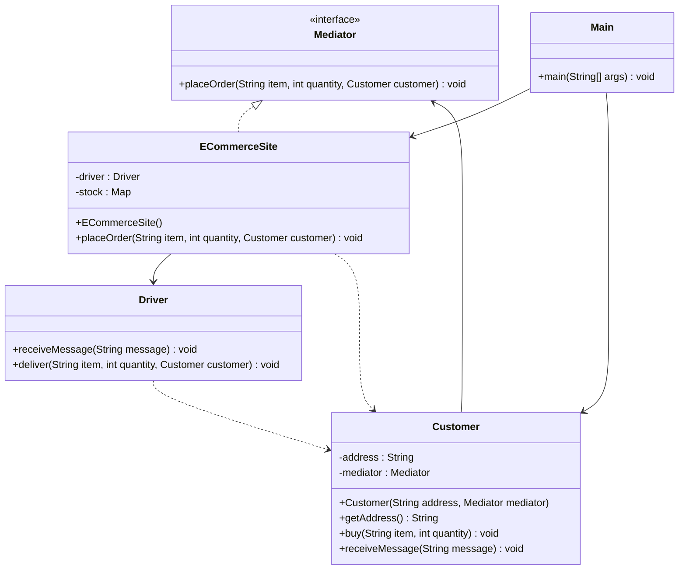

```mermaid
classDiagram
    class Mediator {
        <<interface>>
        +placeOrder(String item, int quantity, Customer customer) void
    }

    class Customer {
        -address : String
        -mediator : Mediator
        +Customer(String address, Mediator mediator)
        +getAddress() String
        +buy(String item, int quantity) void
        +receiveMessage(String message) void
    }

    class Driver {
        +receiveMessage(String message) void
        +deliver(String item, int quantity, Customer customer) void
    }

    class ECommerceSite {
        -driver : Driver
        -stock : Map<String, Integer>
        +ECommerceSite()
        +placeOrder(String item, int quantity, Customer customer) void
    }

    class Main {
        +main(String[] args) void
    }

    Mediator <|.. ECommerceSite
    Customer --> Mediator
    ECommerceSite --> Driver
    ECommerceSite ..> Customer
    Driver ..> Customer
    Main --> ECommerceSite
    Main --> Customer
```
