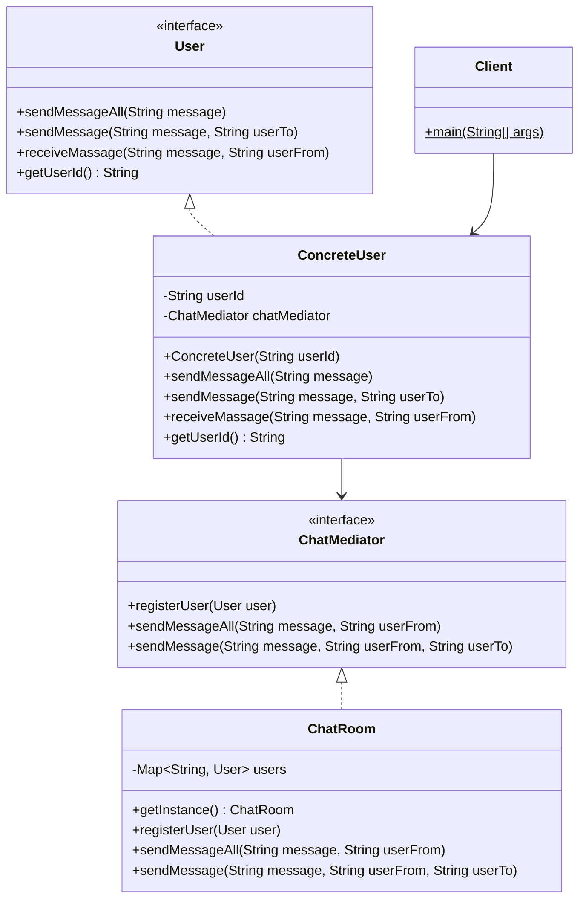

# Месенджер

Реалізація патерну **Mediator** для чату, де обмін повідомленнями проходить через посередника `ChatRoom`.

GitHub-папка завдання:
https://github.com/oleksandrvatamaniuk2003/software_design_patterns/tree/main/lab17_Mediator/task_2_3

