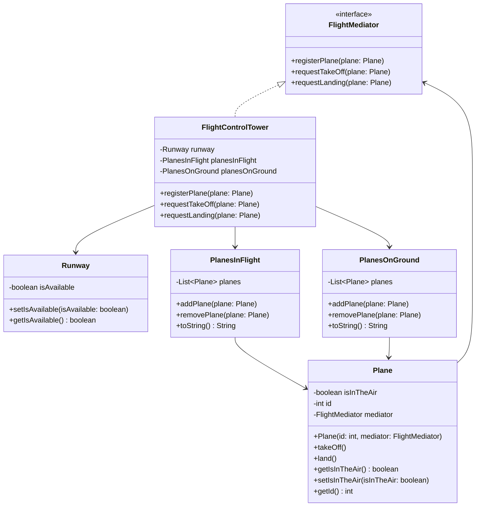

# Симулятор польотів

У цьому завданні виконано рефакторинг стартового коду за патерном **Mediator**.
Клас `FlightControlTower` централізує взаємодію між `Plane`, `Runway`, `PlanesInFlight` і `PlanesOnGround`, тому літак не керує цими об’єктами напряму.

GitHub-папка: https://github.com/oleksandrvatamaniuk2003/software_design_patterns/tree/main/lab17_Mediator/task_3_1

## Запуск

```bash
javac *.java
java Main
```

## Mermaid UML


