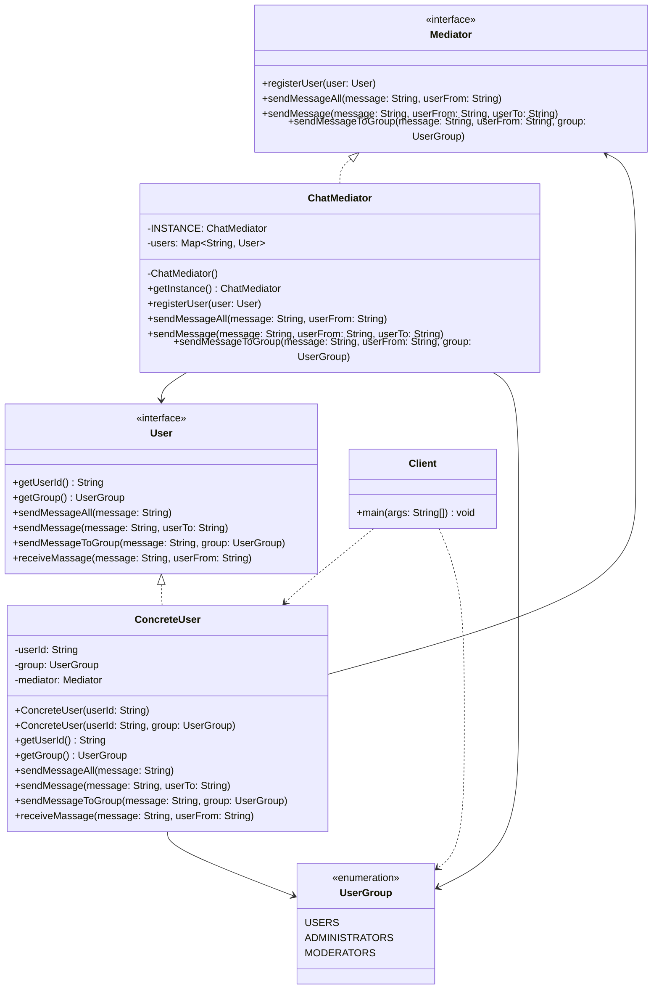

# lab17_Mediator / task_3_2 — Розширений месенджер

## Пояснення патерну
**Mediator** централізує взаємодію між об'єктами. У цій задачі користувачі не знають один про одного напряму — вони надсилають повідомлення через `ChatMediator`.

Це рішення підтримує:
- повідомлення всім користувачам;
- приватні повідомлення конкретному користувачу;
- повідомлення окремій групі користувачів;
- групи: `USERS`, `ADMINISTRATORS`, `MODERATORS`.

## Структура файлів
- `Mediator.java` — інтерфейс посередника;
- `ChatMediator.java` — конкретний посередник;
- `User.java` — інтерфейс користувача;
- `ConcreteUser.java` — конкретний користувач;
- `UserGroup.java` — перелік груп;
- `Client.java` — приклад запуску;
- `README.md` — опис та UML-діаграма.

## Java-код кожного файлу
Усі Java-файли розміщені безпосередньо в папці `lab17_Mediator/task_3_2/`.

## Запуск
В IntelliJ IDEA відкрийте папку `lab17_Mediator/task_3_2` і запустіть `Client.java`.

## Mermaid classDiagram

## Папка в репозиторії
https://github.com/oleksandrvatamaniuk2003/software_design_patterns/tree/main/lab17_Mediator/task_3_2
