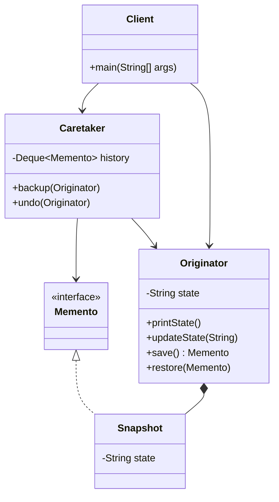

```mermaid
classDiagram
    class Memento {
        <<interface>>
    }

    class Originator {
        -String state
        +printState()
        +updateState(String)
        +save() Memento
        +restore(Memento)
    }

    class Snapshot {
        -String state
    }

    class Caretaker {
        -Deque~Memento~ history
        +backup(Originator)
        +undo(Originator)
    }

    class Client {
        +main(String[] args)
    }

    Memento <|.. Snapshot
    Originator *-- Snapshot
    Caretaker --> Memento
    Caretaker --> Originator
    Client --> Originator
    Client --> Caretaker
```
