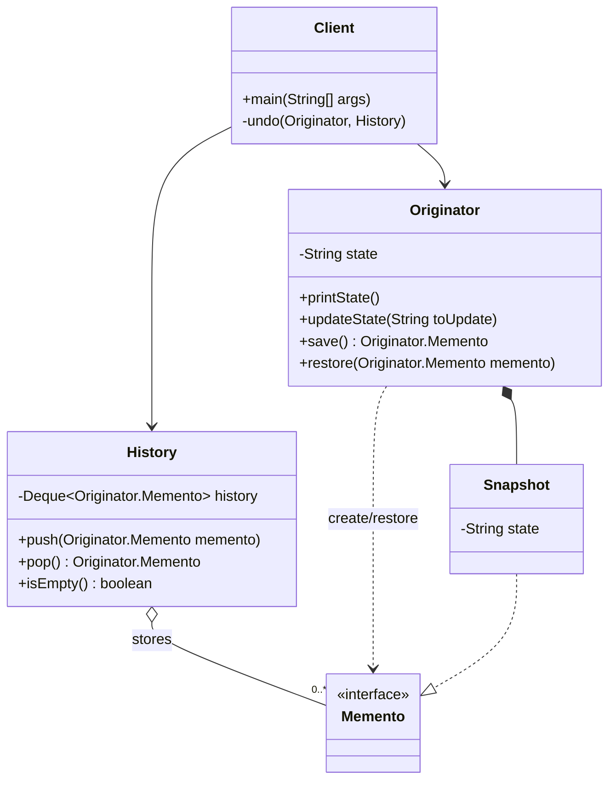

```mermaid
classDiagram
    class Client {
        +main(String[] args)
        -undo(Originator, History)
    }

    class History {
        -Deque~Originator.Memento~ history
        +push(Originator.Memento memento)
        +pop() Originator.Memento
        +isEmpty() boolean
    }

    class Originator {
        -String state
        +printState()
        +updateState(String toUpdate)
        +save() Originator.Memento
        +restore(Originator.Memento memento)
    }

    class Memento {
        <<interface>>
    }

    class Snapshot {
        -String state
    }

    Client --> Originator
    Client --> History
    History o-- "0..*" Memento : stores
    Originator ..> Memento : create/restore
    Snapshot ..|> Memento
    Originator *-- Snapshot
```
