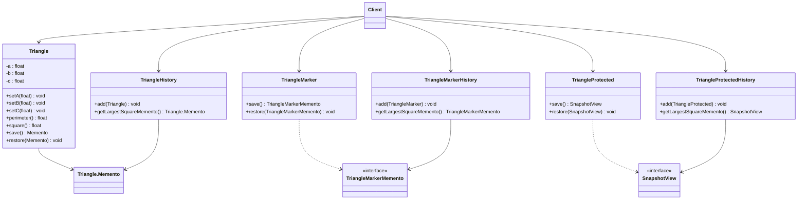

```mermaid
classDiagram
    class Client

    class Triangle {
      -a : float
      -b : float
      -c : float
      +setA(float) void
      +setB(float) void
      +setC(float) void
      +perimeter() float
      +square() float
      +save() Memento
      +restore(Memento) void
    }
    class TriangleMemento["Triangle.Memento"]
    class TriangleHistory {
      +add(Triangle) void
      +getLargestSquareMemento() Triangle.Memento
    }

    class TriangleMarker {
      +save() TriangleMarkerMemento
      +restore(TriangleMarkerMemento) void
    }
    class TriangleMarkerMemento <<interface>>
    class TriangleMarkerHistory {
      +add(TriangleMarker) void
      +getLargestSquareMemento() TriangleMarkerMemento
    }

    class TriangleProtected {
      +save() SnapshotView
      +restore(SnapshotView) void
    }
    class SnapshotView <<interface>>
    class TriangleProtectedHistory {
      +add(TriangleProtected) void
      +getLargestSquareMemento() SnapshotView
    }

    Client --> Triangle
    Client --> TriangleHistory
    Triangle --> TriangleMemento
    TriangleHistory --> TriangleMemento

    Client --> TriangleMarker
    Client --> TriangleMarkerHistory
    TriangleMarker ..> TriangleMarkerMemento
    TriangleMarkerHistory --> TriangleMarkerMemento

    Client --> TriangleProtected
    Client --> TriangleProtectedHistory
    TriangleProtected ..> SnapshotView
    TriangleProtectedHistory --> SnapshotView
```
