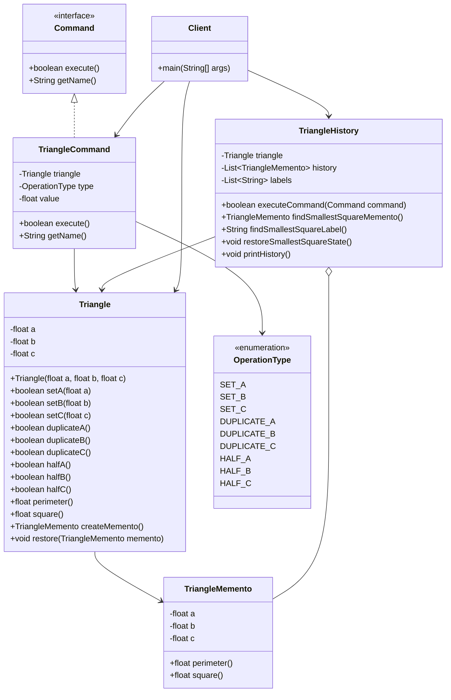

```mermaid
classDiagram
    class Client {
        +main(String[] args)
    }

    class Command {
        <<interface>>
        +boolean execute()
        +String getName()
    }

    class Triangle {
        -float a
        -float b
        -float c
        +Triangle(float a, float b, float c)
        +boolean setA(float a)
        +boolean setB(float b)
        +boolean setC(float c)
        +boolean duplicateA()
        +boolean duplicateB()
        +boolean duplicateC()
        +boolean halfA()
        +boolean halfB()
        +boolean halfC()
        +float perimeter()
        +float square()
        +TriangleMemento createMemento()
        +void restore(TriangleMemento memento)
    }

    class TriangleMemento {
        -float a
        -float b
        -float c
        +float perimeter()
        +float square()
    }

    class TriangleCommand {
        -Triangle triangle
        -OperationType type
        -float value
        +boolean execute()
        +String getName()
    }

    class TriangleHistory {
        -Triangle triangle
        -List~TriangleMemento~ history
        -List~String~ labels
        +boolean executeCommand(Command command)
        +TriangleMemento findSmallestSquareMemento()
        +String findSmallestSquareLabel()
        +void restoreSmallestSquareState()
        +void printHistory()
    }

    class OperationType {
        <<enumeration>>
        SET_A
        SET_B
        SET_C
        DUPLICATE_A
        DUPLICATE_B
        DUPLICATE_C
        HALF_A
        HALF_B
        HALF_C
    }

    Command <|.. TriangleCommand
    TriangleCommand --> Triangle
    TriangleCommand --> OperationType
    Triangle --> TriangleMemento
    TriangleHistory --> Triangle
    TriangleHistory o-- TriangleMemento
    Client --> Triangle
    Client --> TriangleHistory
    Client --> TriangleCommand
```
