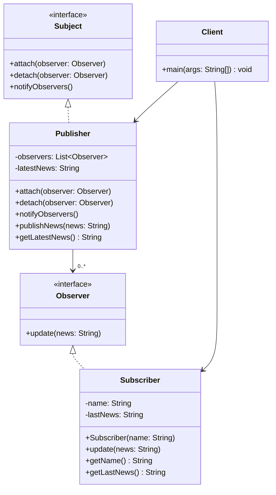

```mermaid
classDiagram
    class Subject {
        <<interface>>
        +attach(observer: Observer)
        +detach(observer: Observer)
        +notifyObservers()
    }

    class Observer {
        <<interface>>
        +update(news: String)
    }

    class Publisher {
        -observers: List~Observer~
        -latestNews: String
        +attach(observer: Observer)
        +detach(observer: Observer)
        +notifyObservers()
        +publishNews(news: String)
        +getLatestNews() String
    }

    class Subscriber {
        -name: String
        -lastNews: String
        +Subscriber(name: String)
        +update(news: String)
        +getName() String
        +getLastNews() String
    }

    class Client {
        +main(args: String[]) void
    }

    Subject <|.. Publisher
    Observer <|.. Subscriber
    Publisher --> "0..*" Observer
    Client --> Publisher
    Client --> Subscriber
```
