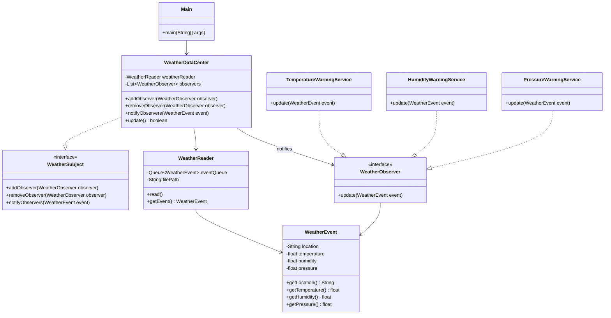

```mermaid
classDiagram
    class Main {
        +main(String[] args)
    }

    class WeatherSubject {
        <<interface>>
        +addObserver(WeatherObserver observer)
        +removeObserver(WeatherObserver observer)
        +notifyObservers(WeatherEvent event)
    }

    class WeatherObserver {
        <<interface>>
        +update(WeatherEvent event)
    }

    class WeatherDataCenter {
        -WeatherReader weatherReader
        -List~WeatherObserver~ observers
        +addObserver(WeatherObserver observer)
        +removeObserver(WeatherObserver observer)
        +notifyObservers(WeatherEvent event)
        +update() boolean
    }

    class WeatherReader {
        -Queue~WeatherEvent~ eventQueue
        -String filePath
        +read()
        +getEvent() WeatherEvent
    }

    class WeatherEvent {
        -String location
        -float temperature
        -float humidity
        -float pressure
        +getLocation() String
        +getTemperature() float
        +getHumidity() float
        +getPressure() float
    }

    class TemperatureWarningService {
        +update(WeatherEvent event)
    }

    class HumidityWarningService {
        +update(WeatherEvent event)
    }

    class PressureWarningService {
        +update(WeatherEvent event)
    }

    WeatherDataCenter ..|> WeatherSubject
    TemperatureWarningService ..|> WeatherObserver
    HumidityWarningService ..|> WeatherObserver
    PressureWarningService ..|> WeatherObserver

    Main --> WeatherDataCenter
    WeatherDataCenter --> WeatherReader
    WeatherDataCenter --> WeatherObserver : notifies
    WeatherReader --> WeatherEvent
    WeatherObserver --> WeatherEvent
```
