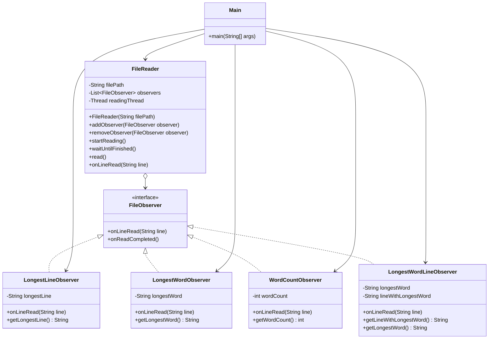

```mermaid
classDiagram
    class FileObserver {
        <<interface>>
        +onLineRead(String line)
        +onReadCompleted()
    }

    class FileReader {
        -String filePath
        -List~FileObserver~ observers
        -Thread readingThread
        +FileReader(String filePath)
        +addObserver(FileObserver observer)
        +removeObserver(FileObserver observer)
        +startReading()
        +waitUntilFinished()
        +read()
        +onLineRead(String line)
    }

    class LongestLineObserver {
        -String longestLine
        +onLineRead(String line)
        +getLongestLine() String
    }

    class LongestWordObserver {
        -String longestWord
        +onLineRead(String line)
        +getLongestWord() String
    }

    class WordCountObserver {
        -int wordCount
        +onLineRead(String line)
        +getWordCount() int
    }

    class LongestWordLineObserver {
        -String longestWord
        -String lineWithLongestWord
        +onLineRead(String line)
        +getLineWithLongestWord() String
        +getLongestWord() String
    }

    class Main {
        +main(String[] args)
    }

    FileObserver <|.. LongestLineObserver
    FileObserver <|.. LongestWordObserver
    FileObserver <|.. WordCountObserver
    FileObserver <|.. LongestWordLineObserver
    FileReader o--> FileObserver
    Main --> FileReader
    Main --> LongestLineObserver
    Main --> LongestWordObserver
    Main --> WordCountObserver
    Main --> LongestWordLineObserver
```
