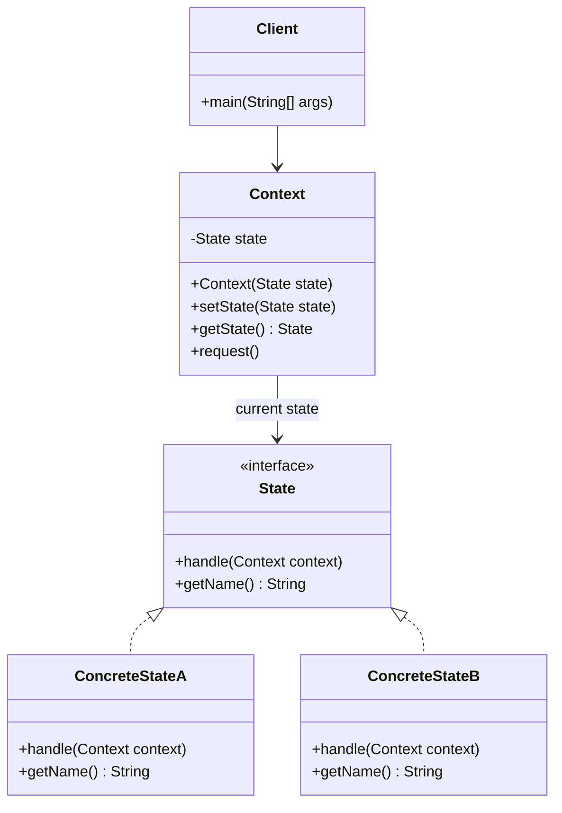

```mermaid
classDiagram
    class Client {
        +main(String[] args)
    }

    class Context {
        -State state
        +Context(State state)
        +setState(State state)
        +getState() State
        +request()
    }

    class State {
        <<interface>>
        +handle(Context context)
        +getName() String
    }

    class ConcreteStateA {
        +handle(Context context)
        +getName() String
    }

    class ConcreteStateB {
        +handle(Context context)
        +getName() String
    }

    State <|.. ConcreteStateA
    State <|.. ConcreteStateB
    Context --> State : current state
    Client --> Context
```
