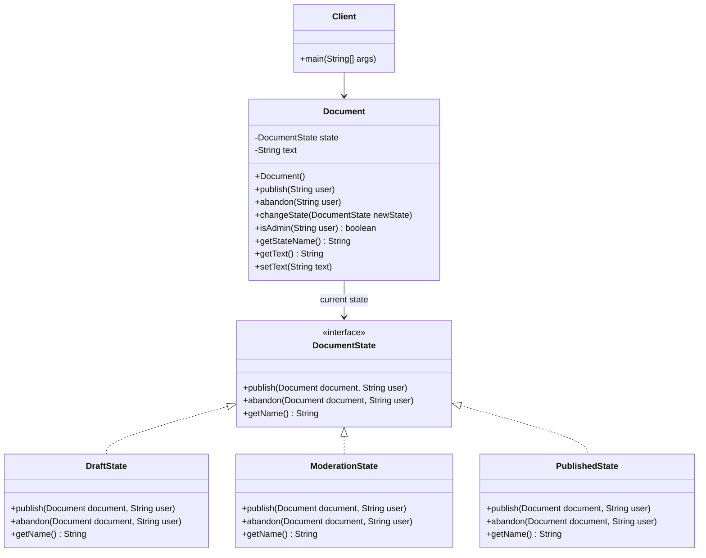

```mermaid
classDiagram
    class Client {
        +main(String[] args)
    }

    class Document {
        -DocumentState state
        -String text
        +Document()
        +publish(String user)
        +abandon(String user)
        +changeState(DocumentState newState)
        +isAdmin(String user) boolean
        +getStateName() String
        +getText() String
        +setText(String text)
    }

    class DocumentState {
        <<interface>>
        +publish(Document document, String user)
        +abandon(Document document, String user)
        +getName() String
    }

    class DraftState {
        +publish(Document document, String user)
        +abandon(Document document, String user)
        +getName() String
    }

    class ModerationState {
        +publish(Document document, String user)
        +abandon(Document document, String user)
        +getName() String
    }

    class PublishedState {
        +publish(Document document, String user)
        +abandon(Document document, String user)
        +getName() String
    }

    Client --> Document
    Document --> DocumentState : current state
    DocumentState <|.. DraftState
    DocumentState <|.. ModerationState
    DocumentState <|.. PublishedState
```
