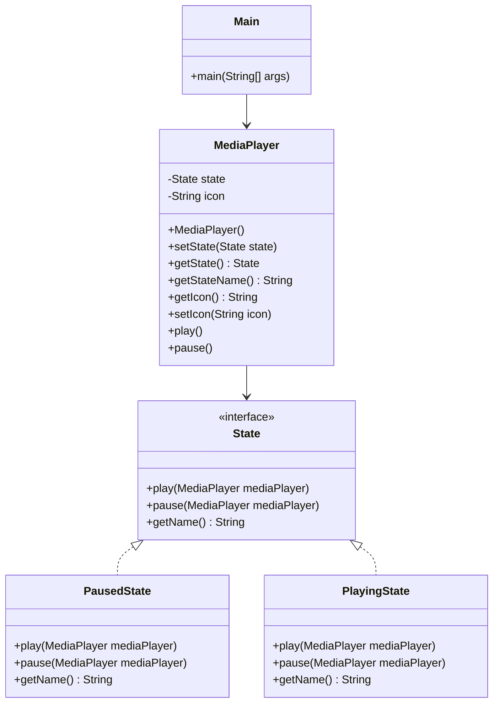

```mermaid
classDiagram
    class Main {
        +main(String[] args)
    }

    class MediaPlayer {
        -State state
        -String icon
        +MediaPlayer()
        +setState(State state)
        +getState() State
        +getStateName() String
        +getIcon() String
        +setIcon(String icon)
        +play()
        +pause()
    }

    class State {
        <<interface>>
        +play(MediaPlayer mediaPlayer)
        +pause(MediaPlayer mediaPlayer)
        +getName() String
    }

    class PausedState {
        +play(MediaPlayer mediaPlayer)
        +pause(MediaPlayer mediaPlayer)
        +getName() String
    }

    class PlayingState {
        +play(MediaPlayer mediaPlayer)
        +pause(MediaPlayer mediaPlayer)
        +getName() String
    }

    Main --> MediaPlayer
    MediaPlayer --> State
    State <|.. PausedState
    State <|.. PlayingState
```
