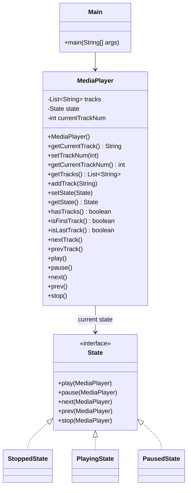

```mermaid
classDiagram
    class Main {
        +main(String[] args)
    }

    class MediaPlayer {
        -List~String~ tracks
        -State state
        -int currentTrackNum
        +MediaPlayer()
        +getCurrentTrack() String
        +setTrackNum(int)
        +getCurrentTrackNum() int
        +getTracks() List~String~
        +addTrack(String)
        +setState(State)
        +getState() State
        +hasTracks() boolean
        +isFirstTrack() boolean
        +isLastTrack() boolean
        +nextTrack()
        +prevTrack()
        +play()
        +pause()
        +next()
        +prev()
        +stop()
    }

    class State {
        <<interface>>
        +play(MediaPlayer)
        +pause(MediaPlayer)
        +next(MediaPlayer)
        +prev(MediaPlayer)
        +stop(MediaPlayer)
    }

    class StoppedState
    class PlayingState
    class PausedState

    Main --> MediaPlayer
    MediaPlayer --> State : current state
    State <|.. StoppedState
    State <|.. PlayingState
    State <|.. PausedState
```

