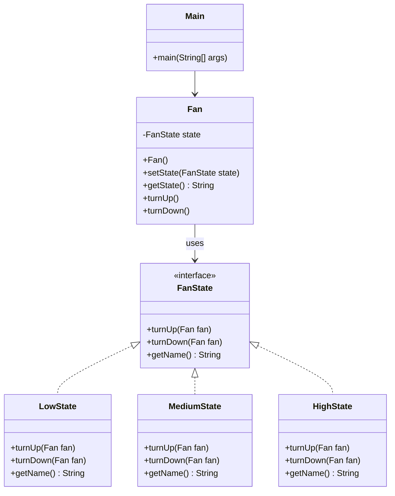

```mermaid
classDiagram
    class Fan {
        -FanState state
        +Fan()
        +setState(FanState state)
        +getState() String
        +turnUp()
        +turnDown()
    }

    class FanState {
        <<interface>>
        +turnUp(Fan fan)
        +turnDown(Fan fan)
        +getName() String
    }

    class LowState {
        +turnUp(Fan fan)
        +turnDown(Fan fan)
        +getName() String
    }

    class MediumState {
        +turnUp(Fan fan)
        +turnDown(Fan fan)
        +getName() String
    }

    class HighState {
        +turnUp(Fan fan)
        +turnDown(Fan fan)
        +getName() String
    }

    class Main {
        +main(String[] args)
    }

    Fan --> FanState : uses
    FanState <|.. LowState
    FanState <|.. MediumState
    FanState <|.. HighState
    Main --> Fan
```

