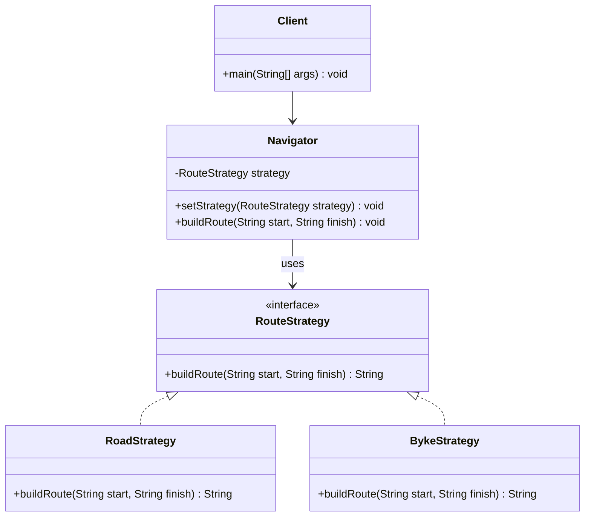

```mermaid
classDiagram
    class RouteStrategy {
        <<interface>>
        +buildRoute(String start, String finish) String
    }

    class Navigator {
        -RouteStrategy strategy
        +setStrategy(RouteStrategy strategy) void
        +buildRoute(String start, String finish) void
    }

    class RoadStrategy {
        +buildRoute(String start, String finish) String
    }

    class BykeStrategy {
        +buildRoute(String start, String finish) String
    }

    class Client {
        +main(String[] args) void
    }

    RouteStrategy <|.. RoadStrategy
    RouteStrategy <|.. BykeStrategy
    Navigator --> RouteStrategy : uses
    Client --> Navigator
```
