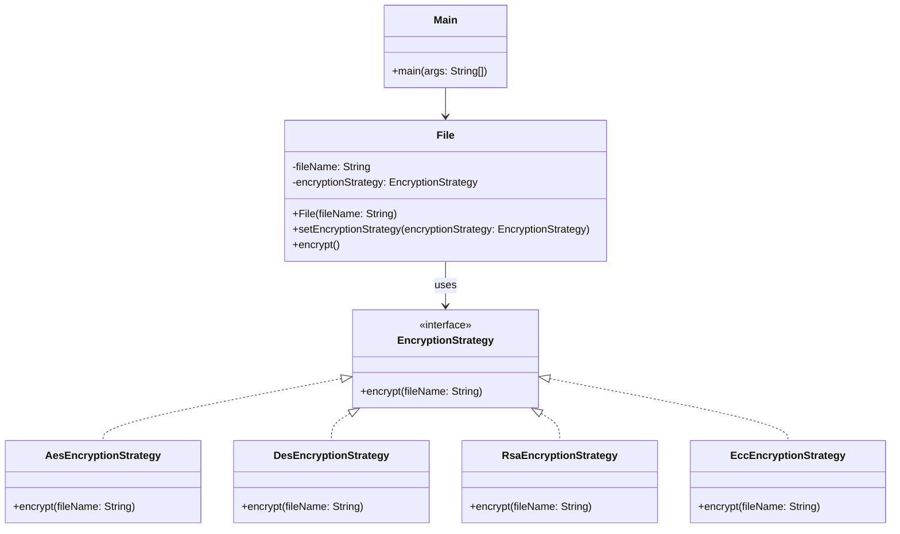

```mermaid
classDiagram
    class EncryptionStrategy {
        <<interface>>
        +encrypt(fileName: String)
    }

    class AesEncryptionStrategy {
        +encrypt(fileName: String)
    }

    class DesEncryptionStrategy {
        +encrypt(fileName: String)
    }

    class RsaEncryptionStrategy {
        +encrypt(fileName: String)
    }

    class EccEncryptionStrategy {
        +encrypt(fileName: String)
    }

    class File {
        -fileName: String
        -encryptionStrategy: EncryptionStrategy
        +File(fileName: String)
        +setEncryptionStrategy(encryptionStrategy: EncryptionStrategy)
        +encrypt()
    }

    class Main {
        +main(args: String[])
    }

    EncryptionStrategy <|.. AesEncryptionStrategy
    EncryptionStrategy <|.. DesEncryptionStrategy
    EncryptionStrategy <|.. RsaEncryptionStrategy
    EncryptionStrategy <|.. EccEncryptionStrategy
    File --> EncryptionStrategy : uses
    Main --> File
```
