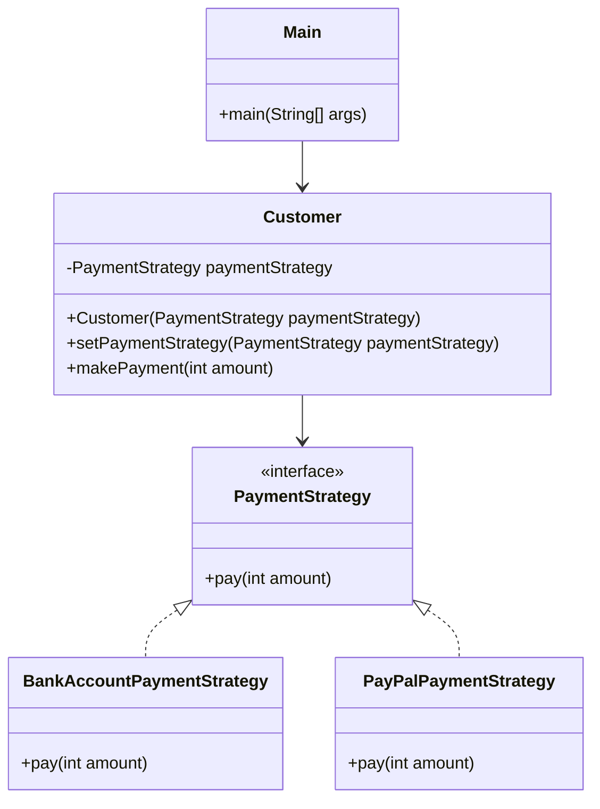

```mermaid
classDiagram
    class PaymentStrategy {
        <<interface>>
        +pay(int amount)
    }

    class BankAccountPaymentStrategy {
        +pay(int amount)
    }

    class PayPalPaymentStrategy {
        +pay(int amount)
    }

    class Customer {
        -PaymentStrategy paymentStrategy
        +Customer(PaymentStrategy paymentStrategy)
        +setPaymentStrategy(PaymentStrategy paymentStrategy)
        +makePayment(int amount)
    }

    class Main {
        +main(String[] args)
    }

    PaymentStrategy <|.. BankAccountPaymentStrategy
    PaymentStrategy <|.. PayPalPaymentStrategy
    Customer --> PaymentStrategy
    Main --> Customer
```
