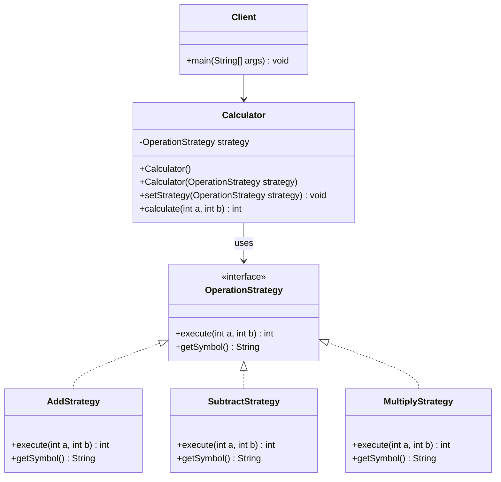

```mermaid
classDiagram
    class OperationStrategy {
        <<interface>>
        +execute(int a, int b) int
        +getSymbol() String
    }

    class AddStrategy {
        +execute(int a, int b) int
        +getSymbol() String
    }

    class SubtractStrategy {
        +execute(int a, int b) int
        +getSymbol() String
    }

    class MultiplyStrategy {
        +execute(int a, int b) int
        +getSymbol() String
    }

    class Calculator {
        -OperationStrategy strategy
        +Calculator()
        +Calculator(OperationStrategy strategy)
        +setStrategy(OperationStrategy strategy) void
        +calculate(int a, int b) int
    }

    class Client {
        +main(String[] args) void
    }

    OperationStrategy <|.. AddStrategy
    OperationStrategy <|.. SubtractStrategy
    OperationStrategy <|.. MultiplyStrategy
    Calculator --> OperationStrategy : uses
    Client --> Calculator
```
