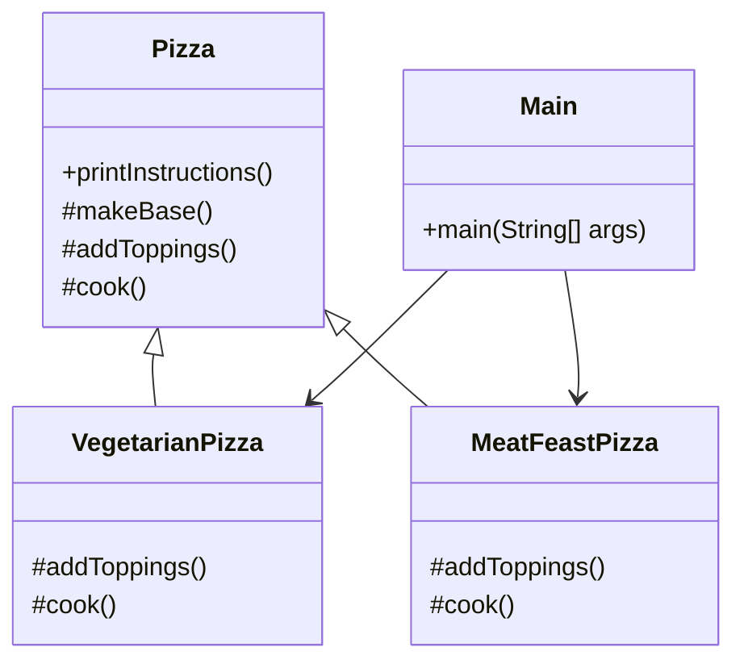

```mermaid
classDiagram
    class Pizza {
        +printInstructions()
        #makeBase()
        #addToppings()
        #cook()
    }

    class VegetarianPizza {
        #addToppings()
        #cook()
    }

    class MeatFeastPizza {
        #addToppings()
        #cook()
    }

    class Main {
        +main(String[] args)
    }

    Pizza <|-- VegetarianPizza
    Pizza <|-- MeatFeastPizza
    Main --> VegetarianPizza
    Main --> MeatFeastPizza
```
