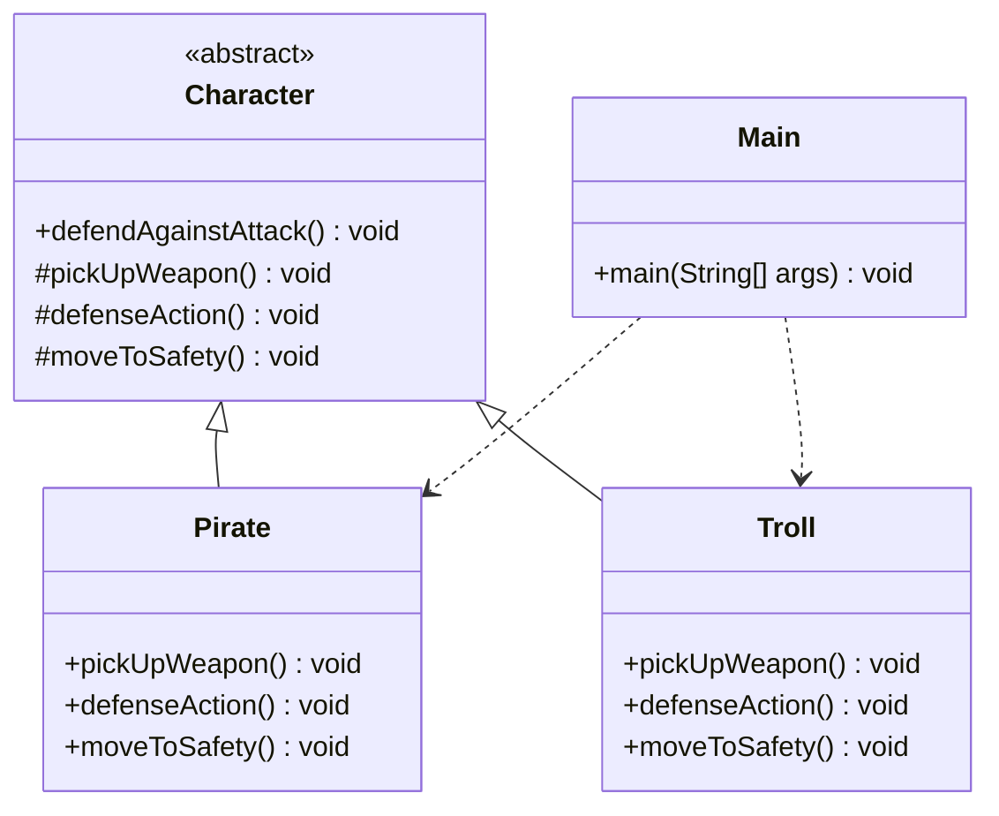

```mermaid
classDiagram
    class Character {
        <<abstract>>
        +defendAgainstAttack() void
        #pickUpWeapon() void
        #defenseAction() void
        #moveToSafety() void
    }

    class Pirate {
        +pickUpWeapon() void
        +defenseAction() void
        +moveToSafety() void
    }

    class Troll {
        +pickUpWeapon() void
        +defenseAction() void
        +moveToSafety() void
    }

    class Main {
        +main(String[] args) void
    }

    Character <|-- Pirate
    Character <|-- Troll
    Main ..> Pirate
    Main ..> Troll
```
