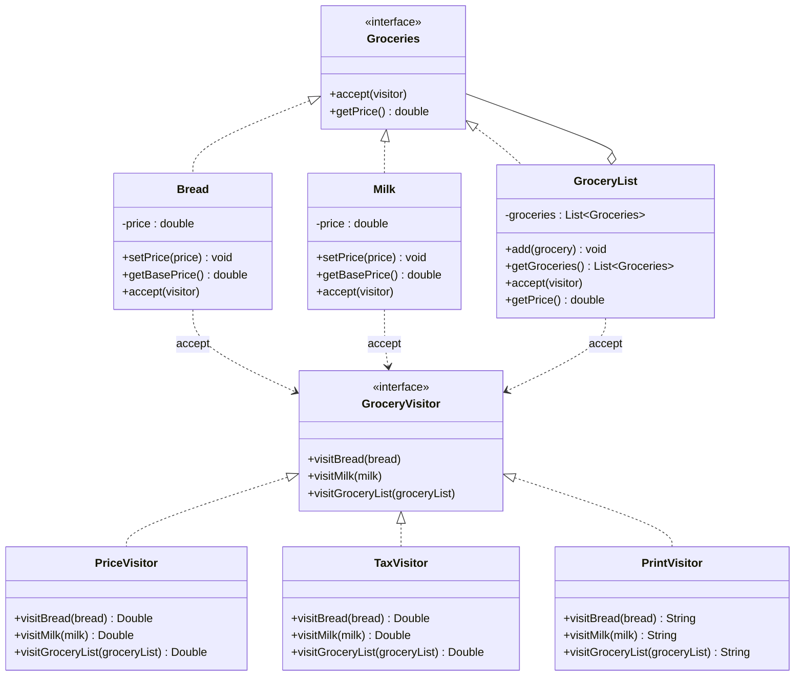

```mermaid
classDiagram
    class Groceries {
        <<interface>>
        +accept(visitor)
        +getPrice() double
    }

    class GroceryVisitor {
        <<interface>>
        +visitBread(bread)
        +visitMilk(milk)
        +visitGroceryList(groceryList)
    }

    class Bread {
        -price : double
        +setPrice(price) void
        +getBasePrice() double
        +accept(visitor)
    }

    class Milk {
        -price : double
        +setPrice(price) void
        +getBasePrice() double
        +accept(visitor)
    }

    class GroceryList {
        -groceries : List~Groceries~
        +add(grocery) void
        +getGroceries() List~Groceries~
        +accept(visitor)
        +getPrice() double
    }

    class PriceVisitor {
        +visitBread(bread) Double
        +visitMilk(milk) Double
        +visitGroceryList(groceryList) Double
    }

    class TaxVisitor {
        +visitBread(bread) Double
        +visitMilk(milk) Double
        +visitGroceryList(groceryList) Double
    }

    class PrintVisitor {
        +visitBread(bread) String
        +visitMilk(milk) String
        +visitGroceryList(groceryList) String
    }

    Groceries <|.. Bread
    Groceries <|.. Milk
    Groceries <|.. GroceryList

    GroceryVisitor <|.. PriceVisitor
    GroceryVisitor <|.. TaxVisitor
    GroceryVisitor <|.. PrintVisitor

    GroceryList o-- Groceries
    Bread ..> GroceryVisitor : accept
    Milk ..> GroceryVisitor : accept
    GroceryList ..> GroceryVisitor : accept
```
