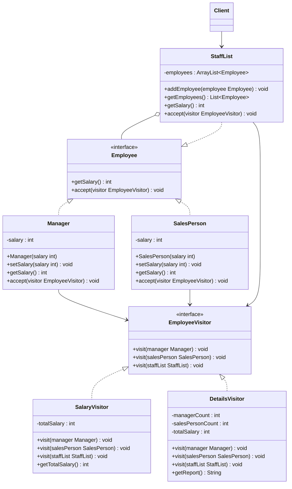

```mermaid
classDiagram
    class Client

    class Employee {
        <<interface>>
        +getSalary() int
        +accept(visitor EmployeeVisitor) void
    }

    class EmployeeVisitor {
        <<interface>>
        +visit(manager Manager) void
        +visit(salesPerson SalesPerson) void
        +visit(staffList StaffList) void
    }

    class Manager {
        -salary : int
        +Manager(salary int)
        +setSalary(salary int) void
        +getSalary() int
        +accept(visitor EmployeeVisitor) void
    }

    class SalesPerson {
        -salary : int
        +SalesPerson(salary int)
        +setSalary(salary int) void
        +getSalary() int
        +accept(visitor EmployeeVisitor) void
    }

    class StaffList {
        -employees : ArrayList~Employee~
        +addEmployee(employee Employee) void
        +getEmployees() List~Employee~
        +getSalary() int
        +accept(visitor EmployeeVisitor) void
    }

    class SalaryVisitor {
        -totalSalary : int
        +visit(manager Manager) void
        +visit(salesPerson SalesPerson) void
        +visit(staffList StaffList) void
        +getTotalSalary() int
    }

    class DetailsVisitor {
        -managerCount : int
        -salesPersonCount : int
        -totalSalary : int
        +visit(manager Manager) void
        +visit(salesPerson SalesPerson) void
        +visit(staffList StaffList) void
        +getReport() String
    }

    Employee <|.. Manager
    Employee <|.. SalesPerson
    Employee <|.. StaffList

    EmployeeVisitor <|.. SalaryVisitor
    EmployeeVisitor <|.. DetailsVisitor

    StaffList o-- Employee
    Client --> StaffList
    Manager --> EmployeeVisitor
    SalesPerson --> EmployeeVisitor
    StaffList --> EmployeeVisitor
```
