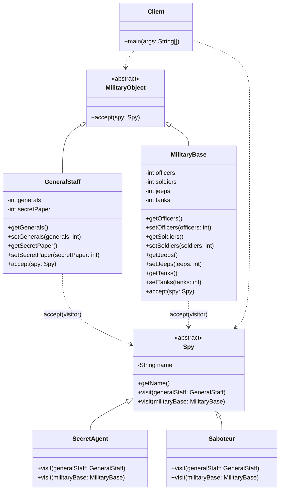

```mermaid
classDiagram
    class MilitaryObject {
        <<abstract>>
        +accept(spy: Spy)
    }

    class GeneralStaff {
        -int generals
        -int secretPaper
        +getGenerals()
        +setGenerals(generals: int)
        +getSecretPaper()
        +setSecretPaper(secretPaper: int)
        +accept(spy: Spy)
    }

    class MilitaryBase {
        -int officers
        -int soldiers
        -int jeeps
        -int tanks
        +getOfficers()
        +setOfficers(officers: int)
        +getSoldiers()
        +setSoldiers(soldiers: int)
        +getJeeps()
        +setJeeps(jeeps: int)
        +getTanks()
        +setTanks(tanks: int)
        +accept(spy: Spy)
    }

    class Spy {
        <<abstract>>
        -String name
        +getName()
        +visit(generalStaff: GeneralStaff)
        +visit(militaryBase: MilitaryBase)
    }

    class SecretAgent {
        +visit(generalStaff: GeneralStaff)
        +visit(militaryBase: MilitaryBase)
    }

    class Saboteur {
        +visit(generalStaff: GeneralStaff)
        +visit(militaryBase: MilitaryBase)
    }

    class Client {
        +main(args: String[])
    }

    MilitaryObject <|-- GeneralStaff
    MilitaryObject <|-- MilitaryBase
    Spy <|-- SecretAgent
    Spy <|-- Saboteur
    GeneralStaff ..> Spy : accept(visitor)
    MilitaryBase ..> Spy : accept(visitor)
    Client ..> MilitaryObject
    Client ..> Spy
```
